# 个人库功能详解

个人库是 ValPoint 的核心功能模块，用于管理您私有的点位数据。本页将详细介绍个人库的各项功能。

<figure class="full-bleed">
  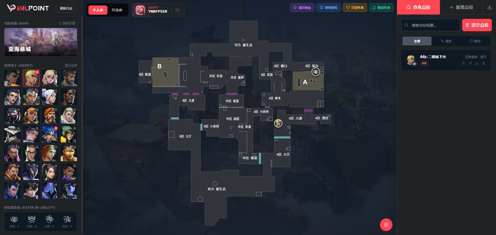
</figure>

## 📊 界面概览

个人库界面分为三个主要区域：

| 区域 | 位置 | 功能 |
|------|------|------|
| 左侧栏 | 屏幕左侧 | 地图、英雄、技能筛选 |
| 中间区 | 屏幕中央 | 交互式地图，展示点位标记 |
| 右侧栏 | 屏幕右侧 | 点位列表、搜索、操作按钮 |

---

## ⬅️ 左侧栏功能

### 地图选择

点击地图缩略图可切换当前查看的地图。切换地图后，中间区和右侧栏会自动更新为该地图下的点位数据。

### 英雄选择

展示所有 Valorant 英雄的头像列表。每个头像右下角会显示该英雄在当前地图下的点位数量。

- 点击头像选中英雄
- 再次点击已选中的英雄可取消选择（显示所有英雄的点位）

### 技能筛选

选中英雄后，会显示该英雄的技能图标。点击技能图标可进一步筛选特定技能的点位。

### 刷新页面

点击"当前地图"标签旁的刷新按钮，可一键重置所有筛选条件到初始状态（第一张地图、第一个英雄、无技能筛选、全部阵营）。

---

## 🗺️ 中间区功能

### 交互式地图

中间区展示当前选中地图的俯视图，并在相应位置显示点位标记。

- **红色标记**：进攻方点位
- **绿色标记**：防守方点位
- 点击标记可查看点位详情

### 新增点位标记

在"新增"模式下，可以在地图上点击设置：

- **站位**：英雄释放技能时的站立位置
- **落点**：技能最终到达的目标位置

---

## ➡️ 右侧栏功能

### 标签页切换

右侧栏顶部有两个标签：

- **浏览**：查看和管理已有点位
- **新增**：创建新的点位
- **导入**：导入点位包

### 搜索功能

在搜索框中输入关键词，可快速筛选点位标题。

### 阵营筛选

提供三个筛选按钮：

- **全部**：显示攻防双方的所有点位
- **进攻**：仅显示进攻方点位
- **防守**：仅显示防守方点位

### 点位列表

展示符合当前筛选条件的所有点位卡片。每张卡片显示：

- 点位标题
- 英雄图标
- 阵营标识
- 操作按钮（查看、下载、删除）

### 置顶功能

点击点位卡片左侧的图钉图标，可将该点位置顶显示（最多置顶 8 个）。

### 导入点位

点击"导入"按钮，可批量导入 ZIP 格式的点位包（最多同时导入 10 个）。

<figure class="full-bleed">
  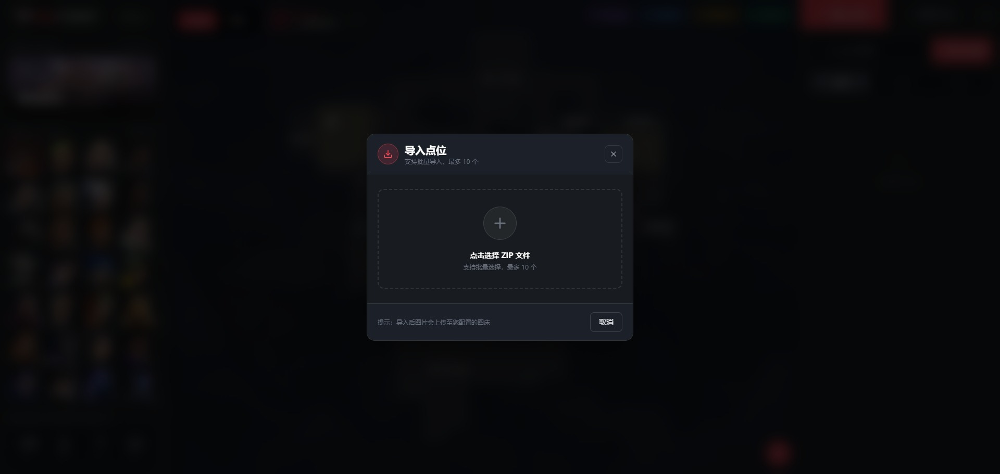
</figure>

#### ZIP 点位包结构

每个点位包是一个 `.zip` 压缩文件，内部包含：

```
点位名称.zip
├── metadata.json    # 点位元数据（必需）
├── stand.png        # 站位截图（可选）
├── stand2.png       # 站位截图 2（可选）
├── aim.png          # 瞄点截图（可选）
├── aim2.png         # 瞄点截图 2（可选）
└── land.png         # 落点截图（可选）
```

#### metadata.json 字段说明

| 字段 | 类型 | 说明 |
|------|------|------|
| `title` | string | 点位标题 |
| `mapName` | string | 地图名称（中文） |
| `agentName` | string | 英雄名称（中文） |
| `side` | string | 阵营：`attack` 或 `defense` |
| `abilityIndex` | number | 技能索引（0-3） |
| `sourceLink` | string | 来源视频链接（可选） |
| `standDesc` | string | 站位描述（可选） |
| `aimDesc` | string | 瞄点描述（可选） |
| `landDesc` | string | 落点描述（可选） |

> [!IMPORTANT]
> 导入时，系统会自动将 ZIP 包内的图片上传至您配置的个人图床。因此导入前必须先完成图床配置。

---

## ⚙️ 快捷操作菜单

点击右上角的齿轮图标，打开快捷操作菜单。

<figure class="full-bleed">
  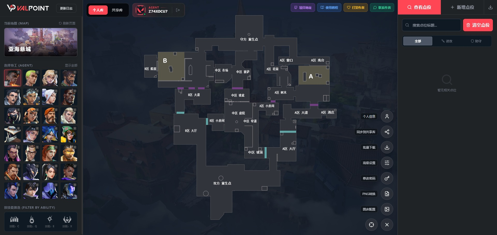
</figure>

### 图床配置

<figure class="full-bleed">
  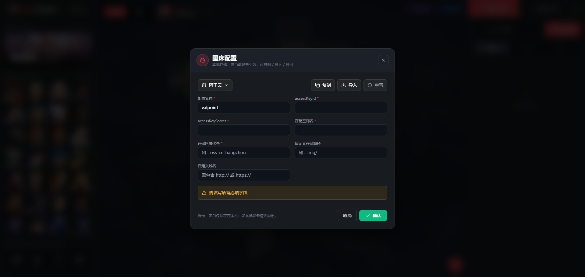
</figure>

配置您的个人图床信息，用于上传点位图片。支持的图床类型：

- **阿里云 OSS**
- **腾讯云 COS**
- **七牛云**

> [!IMPORTANT]
> 图床配置仅保存在当前设备的浏览器中。如需在其他设备使用，请先导出配置。

### 高级设置

<figure class="full-bleed">
  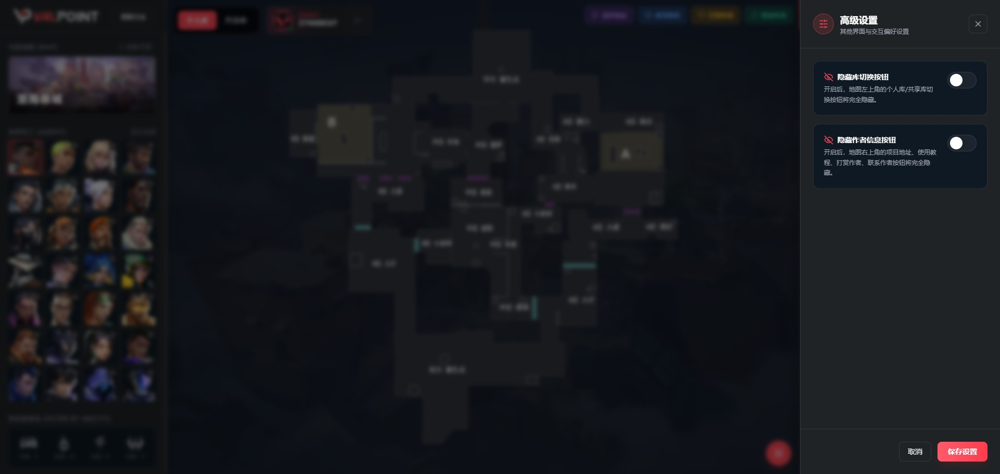
</figure>

提供以下可选配置：

| 选项 | 说明 |
|------|------|
| 隐藏分享按钮 | 下载图片时不显示"分享到共享库"水印 |
| 隐藏作者链接 | 下载图片时不显示原作者信息 |

### PNG 设置

<figure class="full-bleed">
  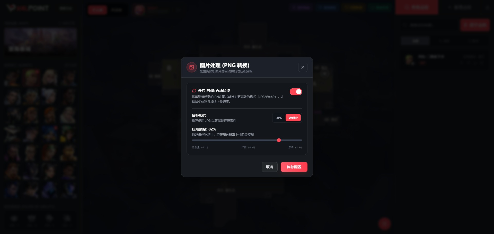
</figure>

自定义下载图片时的输出格式和质量参数。

### 修改密码

<figure class="full-bleed">
  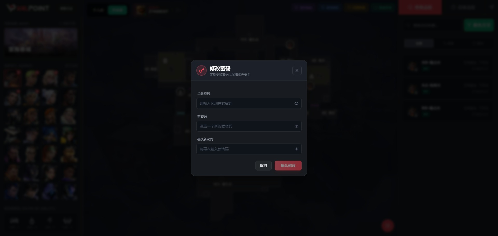
</figure>

更改当前账号的登录密码。

### 清空点位

<figure class="full-bleed">
  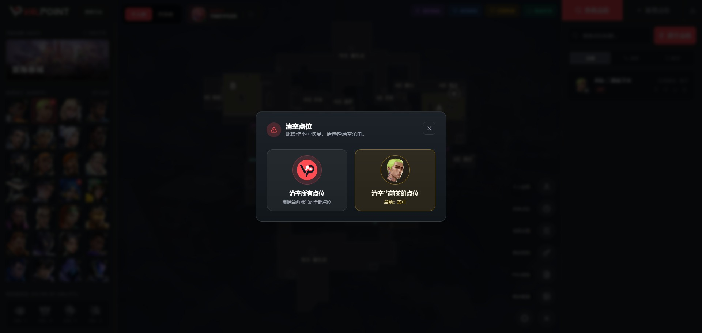
</figure>

> [!CAUTION]
> 此操作不可恢复！

提供两种清空选项：
- **清空当前英雄点位**：仅删除当前选中英雄的所有点位
- **清空全部点位**：删除个人库中的所有点位

### 批量下载

<figure class="full-bleed">
  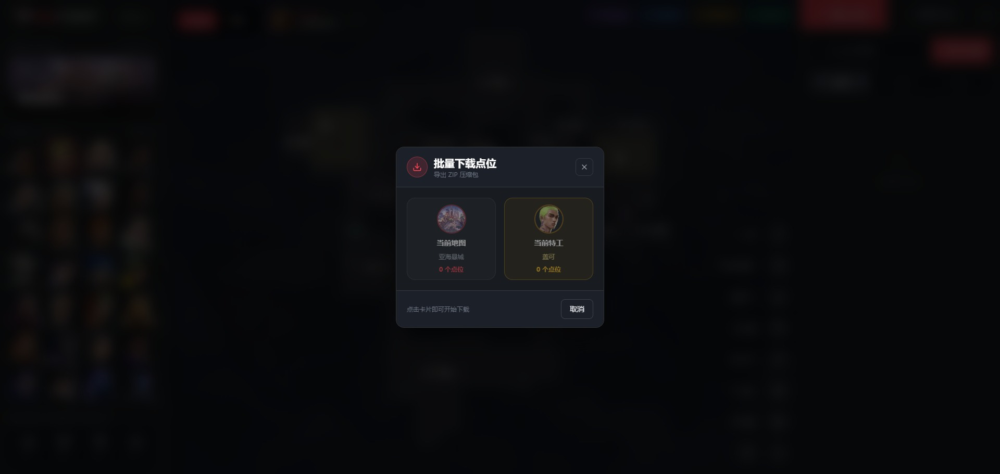
</figure>

将当前地图或当前英雄的所有点位图片批量下载到本地。

> [!NOTE]
> 此功能需要管理员授权或特定权限。

### 投稿管理（因角色不同）

根据用户角色，此功能显示不同内容：

<figure class="full-bleed">
  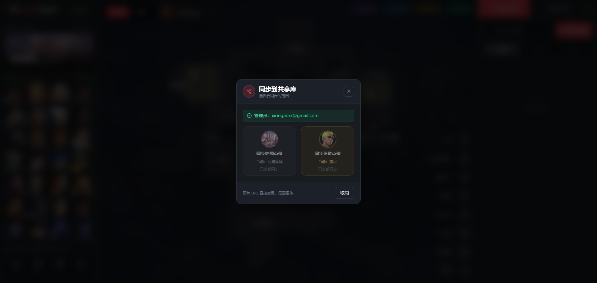
</figure>

<figure class="full-bleed">
  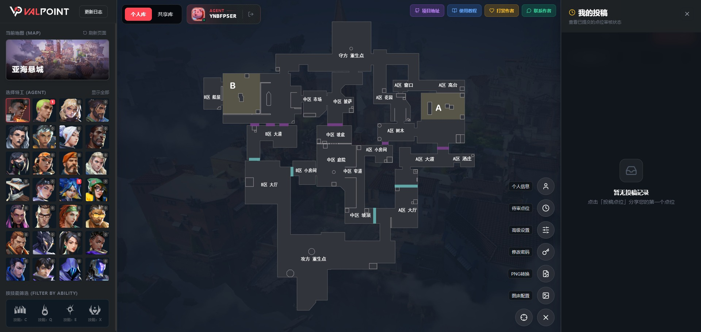
</figure>

| 角色 | 功能名称 | 说明 |
|------|----------|------|
| 管理员 | **同步到共享库** | 直接将点位同步发布到共享库，无需审核 |
| 普通用户 | **待审点位** | 查看已投稿但尚未通过审核的点位列表 |

---

## 📌 点位详情

点击点位卡片或地图标记，打开点位详情弹窗。

<figure class="full-bleed">
  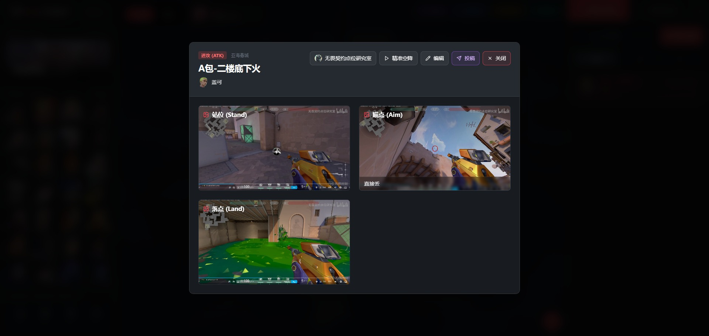
</figure>

### 查看信息

- 点位标题、英雄、阵营、地图
- 站位图、瞄点图、落点图（如有）
- 作者信息（如有来源链接）
- 原视频跳转链接（精准空降）

### 图片预览

点击任意图片可放大查看，支持左右切换浏览。

<figure class="full-bleed">
  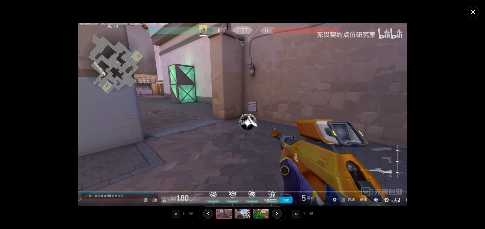
</figure>

> [!TIP]
> 放大查看时，可使用键盘快捷键：
> - `←` / `→` 或 `A` / `D`：切换上一张/下一张图片
> - `Esc`：关闭放大视图

### 编辑点位

点击"编辑"按钮，可修改点位的所有信息。

### 投稿到共享库

点击"投稿"按钮，可将该点位提交到公共共享库供所有用户浏览。

> [!TIP]
> 投稿后，管理员会进行审核。审核通过后，您的点位将出现在共享库中。

---

## 👤 用户中心

点击右上角的头像，可打开用户中心。

<figure class="full-bleed">
  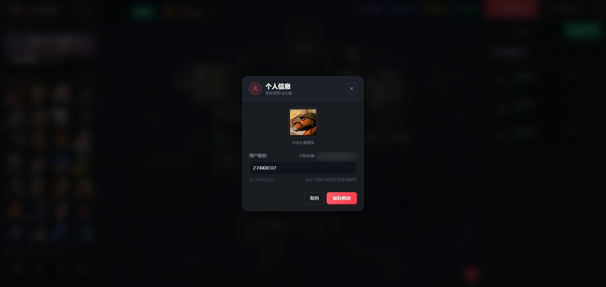
</figure>

### 修改头像

从 Valorant 官方卡面中选择一张作为您的头像。

### 修改昵称

设置一个 8 位以内的英文/数字昵称，用于在共享库中标识您的身份。

### 退出登录

安全退出当前账号。
