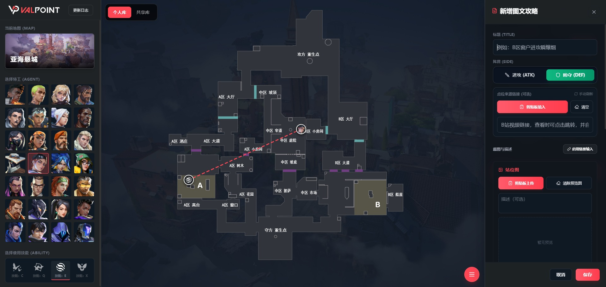

# 使用流程

## 访问应用

ValPoint 包含三个独立入口：

| 入口 | 地址 | 说明 |
|------|------|------|
| 共享库 | `/` 或 `/index.html` | 首页，浏览公共点位 |
| 个人库 | `/user.html` | 登录后管理个人点位 |
| 管理后台 | `/admin.html` | 管理员专用 |

## 登录方式

使用邮箱注册/登录，支持以下功能：

### 游客模式（无需登录）

- ✅ 浏览共享库中的所有点位
- ✅ 查看点位详情和图片
- ❌ 无法保存点位到个人库

### 登录用户

- ✅ 新增、编辑、删除个人点位
- ✅ 从共享库下载点位到个人库
- ✅ 配置个人图床上传图片
- ✅ 向共享库投稿点位

## 个人库

个人库展示当前登录用户保存的点位。

### 查看点位

1. 选择地图 → 英雄 → 技能 → 阵营（攻/防）
2. 点击地图上的标记或右侧点位卡片
3. 查看点位详情和图文攻略

<figure class="full-bleed">
  
</figure>

### 新增点位

1. 点击右上角 `新增点位`
2. 选择地图、英雄、技能、阵营
3. 点击 `设置站位` 在地图中标记英雄位置
4. 点击 `设置落点` 在地图中标记技能落点
5. 填写图文攻略（标题必填）
6. 可选填写来源链接（自动获取作者信息）
7. 上传图片（支持剪贴板粘贴或链接输入）
8. 点击 `保存`

<figure class="full-bleed">
  
</figure>

## 共享库

共享库展示所有用户分享的点位。

### 浏览点位

无需登录即可浏览所有公开点位。点击地图标记或右侧列表中的点位卡片，查看详情弹窗。

### 保存到个人库

1. 登录后，在点位详情弹窗右上角可看到操作按钮
2. 点击 **下载**（绿色按钮）可下载点位图像包到本地
3. 点击 **保存**（黄色按钮）可将点位保存到个人库

> [!IMPORTANT]
> 首次保存点位前，必须先配置个人图床。系统会自动将原作者的图片迁移到您的图床，确保数据长期可用。
