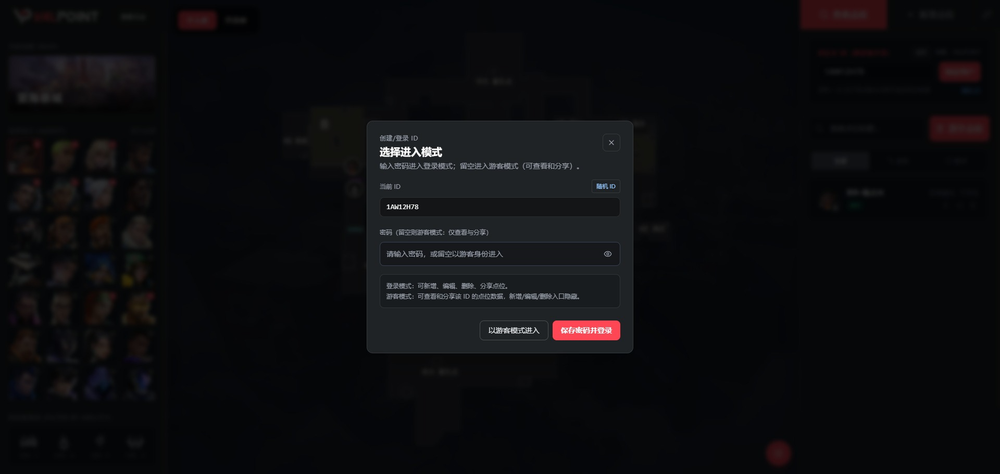

# 使用流程

## 选择登录模式

<figure class="full-bleed">
  
</figure>

### 游客模式

无需登录即可：
- 查看共享库中的点位

### 登录模式

登录后可以：
- 新增、编辑、删除、置顶个人点位
- 分享点位到共享库
- 从共享库复制点位到个人库
- 配置图床上传图片
- 修改密码

## 查看点位

- 选择英雄、技能、阵营
- 或者选择点位卡片，即可查看点位图片

<figure class="full-bleed">
  
</figure>

<figure class="full-bleed">
  
</figure>

## 新增点位

1. 点击主页右上角的 `新增点位`
2. 在左侧栏分别选择地图、英雄、技能
3. 选择 `攻方` 或 `防守方`
4. 点击 `设置站位` ，在中部地图中标记英雄点位
5. 点击 `设置落点` ，在中部地图中标记技能落点点位
6. 点击 `填写图文攻略`
7. 设置点位标题（必填）
8. 点位来源链接 (可选)，更多详情看[作者信息自动获取](作者信息自动获取.md)
9. 图片上传可选剪贴板、链接输入
10. 点击 `保存`

<figure class="full-bleed">
  
</figure>

## 共享库

共享库显示用户分享的点位数据，点击点位卡片，可以将点位保存到自己的个人库中，同时可以选择转移替换点位图片到自己的图床，也可以保持使用分享者图片，但都建议保存到自己的图床中，如果别人开了

