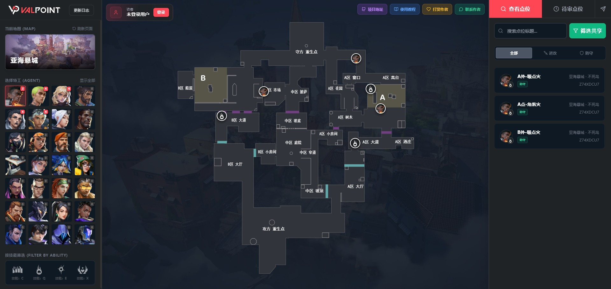
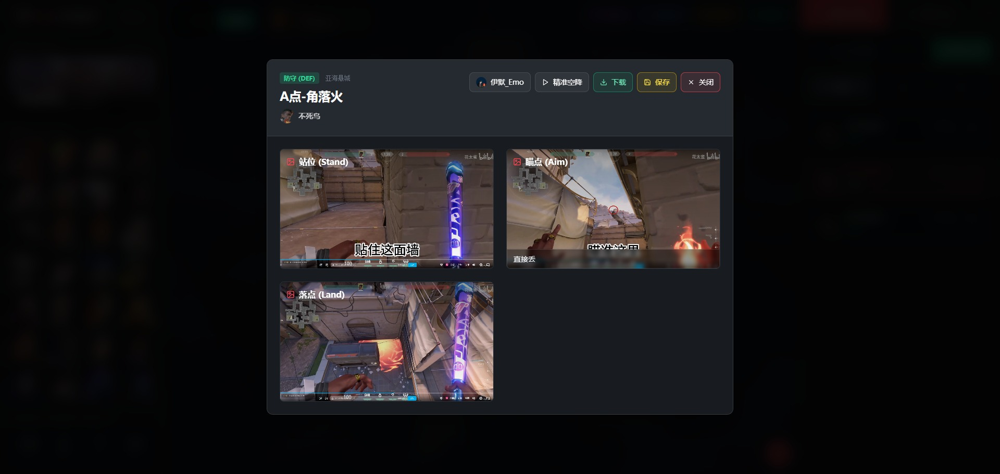

# 共享库功能详解

共享库是 ValPoint 的公共点位展示区，汇集了所有用户投稿的优质点位。本页将详细介绍共享库的各项功能。

<figure class="full-bleed">
  
</figure>

## 📊 界面概览

共享库界面与个人库类似，分为三个主要区域：

| 区域 | 位置 | 功能 |
|------|------|------|
| 左侧栏 | 屏幕左侧 | 地图、英雄、技能筛选 |
| 中间区 | 屏幕中央 | 交互式地图，展示点位标记 |
| 右侧栏 | 屏幕右侧 | 点位列表、搜索 |

---

## ⬅️ 左侧栏功能

### 地图选择

点击地图缩略图可切换当前查看的地图。共享库会展示该地图下所有已通过审核的公共点位。

### 英雄选择

展示所有 Valorant 英雄的头像列表。每个头像右下角会显示该英雄在当前地图下的公共点位数量。

- 点击头像选中英雄
- 再次点击已选中的英雄可取消选择

### 技能筛选

选中英雄后，会显示该英雄的技能图标。点击技能图标可进一步筛选特定技能的点位。

### 刷新页面

点击"当前地图"标签旁的刷新按钮，可一键重置所有筛选条件到初始状态。

---

## 🗺️ 中间区功能

### 交互式地图

中间区展示当前选中地图的俯视图，点位以不同颜色标记：

- **红色标记**：进攻方点位
- **绿色标记**：防守方点位

点击标记可打开点位详情弹窗。

---

## ➡️ 右侧栏功能

### 搜索功能

在搜索框中输入关键词，可快速筛选点位标题。

### 阵营筛选

提供三个筛选按钮：

- **全部**：显示攻防双方的所有点位
- **进攻**：仅显示进攻方点位
- **防守**：仅显示防守方点位

### 点位列表

展示符合当前筛选条件的所有公共点位卡片。每张卡片显示：

- 点位标题
- 英雄图标
- 阵营标识
- 投稿作者信息

点击卡片可打开点位详情。

---

## 📌 点位详情弹窗

点击点位卡片或地图标记，打开点位详情弹窗。

<figure class="full-bleed">
  
</figure>

### 基本信息

弹窗顶部显示点位的基本信息：

- **阵营标签**：进攻 (ATK) 或 防守 (DEF)
- **地图名称**：当前点位所属地图
- **点位标题**：点位的名称
- **英雄信息**：使用的英雄图标和名称

### 作者信息

如果点位包含来源链接，会自动解析并显示原作者的头像和昵称。点击可跳转至作者的 Bilibili/抖音 主页。

### 精准空降

点击"精准空降"按钮，可直接跳转至原视频的具体时间点，方便快速学习点位操作。

### 操作按钮

弹窗右上角提供以下操作按钮：

| 按钮 | 颜色 | 功能 |
|------|------|------|
| 下载 | 绿色 | 将点位图片打包下载至本地 |
| 保存 | 黄色 | 保存点位到个人库 |
| 关闭 | 红色 | 关闭详情弹窗 |

### 图片预览

弹窗下方展示点位的所有截图：

- **站位 (Stand)**：英雄站立位置截图
- **站位 2 (Stand)**：第二张站位截图（如有）
- **瞄点 (Aim)**：瞄准位置截图
- **瞄点 2 (Aim)**：第二张瞄准截图（如有）
- **落点 (Land)**：技能最终落点截图

点击任意图片可放大查看，支持左右切换浏览。

> [!TIP]
> 放大查看时，可使用键盘快捷键：
> - `←` / `→` 或 `A` / `D`：切换上一张/下一张图片
> - `Esc`：关闭放大视图

---

### 保存到个人库

#### 前置条件

保存点位前需要满足以下条件：

1. **登录账号**：必须使用邮箱登录
2. **配置图床**：必须完成个人图床配置

#### 保存流程

1. 在点位详情弹窗中点击 **保存**（黄色按钮）
2. 如未配置图床，系统会提示先完成配置
3. 系统自动将原作者的图片迁移到您的个人图床
4. 迁移完成后，点位保存到您的个人库
5. 弹窗自动关闭，可前往个人库查看

> [!IMPORTANT]
> 为确保数据长期可用，系统不再支持直接引用原作者的图片链接。保存时会强制进行图片迁移。

#### 迁移进度

保存过程中，右下角会显示迁移进度条，包括：

- 当前正在迁移的图片索引
- 总图片数量
- 预估剩余时间

---

## ⬇️ 下载点位

点击 **下载**（绿色按钮）可将点位的所有图片打包下载到本地。

下载的 ZIP 包结构：

```
点位标题.zip
├── metadata.json    # 点位元数据
├── stand.png        # 站位截图
├── aim.png          # 瞄点截图
└── land.png         # 落点截图（如有）
```

> [!TIP]
> 下载的 ZIP 包可以导入到其他 ValPoint 实例的个人库中。

---

## 👤 用户中心

### 已登录用户

点击右上角的用户头像，可以：

- 查看/修改个人信息（头像、昵称）
- 退出登录

### 未登录用户

点击右上角的"登录"按钮，可以：

- 使用邮箱注册新账号
- 登录已有账号
