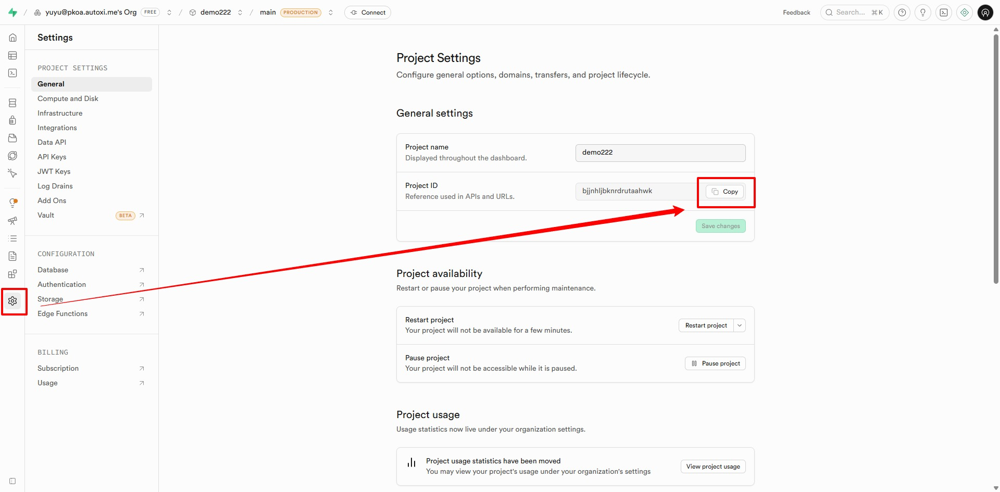
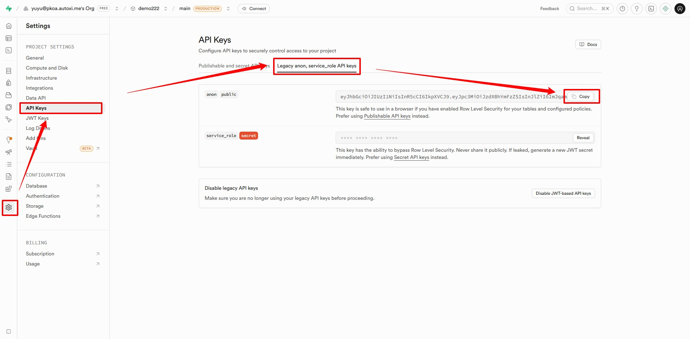

# 快速开始

## 📋 前置准备

<script setup lang="ts">
const prereqItems = [
  {
    image: {
      light: '../public/aliyun_dark.png',
      dark: '../public/aliyun.png',
    },
    name: '阿里云',
    desc: '推荐【阿里云】作为点位图片存储方案。',
    link: 'https://oss.console.aliyun.com/bucket',
  },
  {
    image: {
      light: '../public/supabase_dark.png',
      dark: '../public/supabase.png',
    },
    name: 'Supabase',
    desc: '作为后端数据存储使用，如：点位数据、平台用户。',
    link: 'https://supabase.com/',
  },
  {
    image: {
      light: '../public/piclist_dark.png',
      dark: '../public/piclist.png',
    },
    name: 'Piclist',
    desc: '当你有自己的图床时，可以使用这个软件配合本项目使用。',
    link: 'https://piclist.cn/',
  },
  {
    image: {
      light: '../public/nodejs_dark.png',
      dark: '../public/nodejs.png',
      crop: true,
    },
    name: 'NodeJS',
    desc: '版本 >= 18',
    link: 'https://piclist.cn/',
  },
  {
    image: {
      light: '../public/npm_dark.png',
      dark: '../public/npm.png',
    },
    name: 'npm',
    desc: '无版本要求',
    link: 'https://piclist.cn/',
  },
] as const
</script>

<Links
  :grid="3"
  :items="prereqItems"
/>

### supabase建表

[点我跳转-数据库建表](数据库建表.md)

### 配置图床

[点我跳转-图床配置](图床配置.md)

## 📦 安装步骤

### 1. 克隆项目

```bash
git clone https://github.com/xiongaox/valpoint.git
cd valpoint
```

### 2. 安装依赖

```bash
npm install
# 或
pnpm install
```

### 3. 配置环境变量

::: danger 注意

以下有关环境变量的,都是我用临时邮箱注册 `supabase` 创建的，属于是教学使用，请务必看准，更换为自己的配置，不要照抄。

:::

复制 `.env.example` 为 `.env` ，填入你的 Supabase 配置：

```ini
# Supabase 配置（必填）
VITE_SUPABASE_URL=https://[PROJECT_ID].supabase.co
VITE_SUPABASE_ANON_KEY=[YOUR_ANON_KEY]
```

复制的 `Project ID` 替换掉 `[PROJECT_ID]` ，如： `https://iblvywdnldcwhtltlvjf.supabase.co`
<figure class="full-bleed">
  
  <figcaption>VITE_SUPABASE_URL</figcaption>
</figure>

<figure class="full-bleed">
  
  <figcaption>VITE_SUPABASE_ANON_KEY</figcaption>
</figure>


### 4. 启动开发服务器

```bash
npm run dev
```

### 5. 访问应用

打开浏览器访问：`http://localhost:3208`

::: tip 多入口应用
ValPoint 采用 MPA 架构，包含以下入口：
- **用户端**：`http://localhost:3208/user.html`
- **管理后台**：`http://localhost:3208/admin.html`
:::

## 🚀 部署指南

[点我跳转-部署指南](部署指南.md)

## 👉 下一步

- [使用流程]( 使用流程.md) - 学习如何新建你的点位
- [作者信息获取](作者信息自动获取.md) - 了解如何自动获取视频作者信息
