# 数据库建表

## 📝 概述

ValPoint 使用 Supabase 作为后端，采用 PostgreSQL 数据库。本文档提供一键建表脚本，可快速初始化完整的数据库结构。

## 🆕 新建Supabase项目

<figure class="full-bleed">
  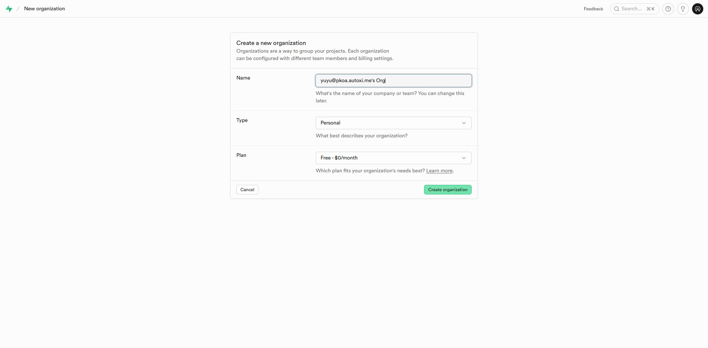
  <figcaption>新建项目</figcaption>
</figure>

<figure class="full-bleed">
  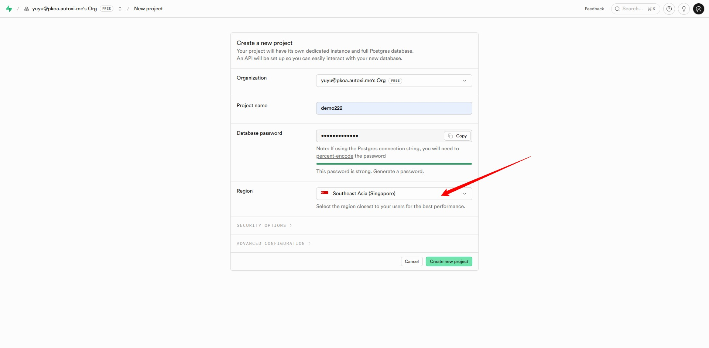
  <figcaption>要选择 新加坡 地域</figcaption>
</figure>

## 📊 数据库架构

系统包含 7 张核心数据表：

| 表名 | 用途 |
|------|------|
| `user_profiles` | 用户资料（角色、权限、下载统计）|
| `valorant_lineups` | 个人点位库 |
| `valorant_shared` | 共享中心库 |
| `lineup_submissions` | 点位投稿审核 |
| `user_daily_downloads` | 每日下载限制 |
| `system_settings` | 系统设置（图床、投稿开关）|
| `download_logs` | 下载日志记录 |

## 🚀 一键建表脚本

> [!TIP]
> 以下脚本是幂等的，可以重复执行。在 Supabase Dashboard → SQL Editor 中执行即可。


::: details 点击查看完整脚本

```sql
-- ==========================================
-- ValPoint Supabase 数据库一键重建脚本
-- 版本: 2.1 | 优化日期: 2025-12-29
-- ==========================================
-- 使用说明:
-- 1. 在 Supabase Dashboard -> SQL Editor 中执行此脚本
-- 2. 执行前确保已启用 Email Auth Provider
-- 3. 脚本是幂等的，可重复执行
-- ==========================================

-- ==========================================
-- 1. 基础扩展
-- ==========================================
CREATE EXTENSION IF NOT EXISTS "uuid-ossp";
CREATE EXTENSION IF NOT EXISTS "pgcrypto";

-- ==========================================
-- 2. 通用函数
-- ==========================================

-- 自动更新 updated_at 时间戳
CREATE OR REPLACE FUNCTION handle_updated_at()
RETURNS TRIGGER AS $$
BEGIN
    NEW.updated_at = NOW();
    RETURN NEW;
END;
$$ LANGUAGE plpgsql;

-- 新用户注册时自动创建 user_profiles 记录
CREATE OR REPLACE FUNCTION public.handle_new_user()
RETURNS TRIGGER AS $$
BEGIN
    INSERT INTO public.user_profiles (id, email, nickname, custom_id, avatar, role)
    VALUES (
        NEW.id,
        NEW.email,
        COALESCE(NEW.raw_user_meta_data->>'nickname', ''),
        COALESCE(NEW.raw_user_meta_data->>'custom_id', ''),
        COALESCE(NEW.raw_user_meta_data->>'avatar', ''),
        'user'
    );
    RETURN NEW;
END;
$$ LANGUAGE plpgsql SECURITY DEFINER;

-- 自动累计下载次数
CREATE OR REPLACE FUNCTION public.increment_user_download_count()
RETURNS TRIGGER AS $$
BEGIN
    IF NEW.user_id IS NOT NULL THEN
        UPDATE public.user_profiles
        SET download_count = COALESCE(download_count, 0) + COALESCE(NEW.download_count, 1)
        WHERE id = NEW.user_id;
    END IF;
    RETURN NEW;
END;
$$ LANGUAGE plpgsql SECURITY DEFINER;

-- 管理员权限检查函数
CREATE OR REPLACE FUNCTION public.is_admin()
RETURNS BOOLEAN AS $$
BEGIN
  RETURN EXISTS (
    SELECT 1 FROM public.user_profiles
    WHERE id = auth.uid() AND role IN ('admin', 'super_admin')
  );
END;
$$ LANGUAGE plpgsql SECURITY DEFINER;

-- 获取用户角色（避免 RLS 递归）
CREATE OR REPLACE FUNCTION public.get_user_role(user_id uuid)
RETURNS text
LANGUAGE sql
SECURITY DEFINER
SET search_path = public
AS $$
  SELECT role::text FROM user_profiles WHERE id = user_id;
$$;

-- ==========================================
-- 3. 数据表定义
-- ==========================================

-- 用户资料表
CREATE TABLE IF NOT EXISTS public.user_profiles (
    id UUID PRIMARY KEY REFERENCES auth.users(id) ON DELETE CASCADE,
    email TEXT,
    nickname TEXT,
    avatar TEXT,
    custom_id TEXT UNIQUE,
    role TEXT DEFAULT 'user' CHECK (role IN ('user', 'admin', 'super_admin')),
    is_banned BOOLEAN DEFAULT false,
    ban_reason TEXT,
    download_count BIGINT DEFAULT 0,
    can_batch_download BOOLEAN DEFAULT false,
    pinned_lineup_ids JSONB DEFAULT '[]'::jsonb,
    subscriptions JSONB DEFAULT '[]'::jsonb,
    created_at TIMESTAMPTZ DEFAULT NOW(),
    updated_at TIMESTAMPTZ DEFAULT NOW()
);

-- 个人点位库
CREATE TABLE IF NOT EXISTS public.valorant_lineups (
    id UUID PRIMARY KEY DEFAULT uuid_generate_v4(),
    user_id UUID REFERENCES auth.users(id) ON DELETE CASCADE,
    title TEXT,
    map_name TEXT,
    agent_name TEXT,
    agent_icon TEXT,
    skill_icon TEXT,
    side TEXT CHECK (side IN ('attack', 'defense')),
    ability_index INTEGER,
    agent_pos JSONB,
    skill_pos JSONB,
    stand_img TEXT,
    stand_desc TEXT,
    stand2_img TEXT,
    stand2_desc TEXT,
    aim_img TEXT,
    aim_desc TEXT,
    aim2_img TEXT,
    aim2_desc TEXT,
    land_img TEXT,
    land_desc TEXT,
    source_link TEXT,
    cloned_from UUID,
    author_name TEXT,
    author_avatar TEXT,
    author_uid TEXT,
    created_at TIMESTAMPTZ DEFAULT NOW(),
    updated_at TIMESTAMPTZ DEFAULT NOW()
);

-- 共享中心库
CREATE TABLE IF NOT EXISTS public.valorant_shared (
    id UUID PRIMARY KEY DEFAULT uuid_generate_v4(),
    source_id TEXT,
    title TEXT,
    map_name TEXT,
    agent_name TEXT,
    agent_icon TEXT,
    skill_icon TEXT,
    side TEXT CHECK (side IN ('attack', 'defense')),
    ability_index INTEGER,
    agent_pos JSONB,
    skill_pos JSONB,
    stand_img TEXT,
    stand_desc TEXT,
    stand2_img TEXT,
    stand2_desc TEXT,
    aim_img TEXT,
    aim_desc TEXT,
    aim2_img TEXT,
    aim2_desc TEXT,
    land_img TEXT,
    land_desc TEXT,
    source_link TEXT,
    author_name TEXT,
    author_avatar TEXT,
    author_uid TEXT,
    created_at TIMESTAMPTZ DEFAULT NOW(),
    updated_at TIMESTAMPTZ DEFAULT NOW()
);

-- 点位投稿审核表
CREATE TABLE IF NOT EXISTS public.lineup_submissions (
    id UUID PRIMARY KEY DEFAULT uuid_generate_v4(),
    submitter_id UUID REFERENCES auth.users(id) ON DELETE CASCADE,
    submitter_email TEXT,
    title TEXT,
    map_name TEXT,
    agent_name TEXT,
    agent_icon TEXT,
    skill_icon TEXT,
    side TEXT DEFAULT 'attack' CHECK (side IN ('attack', 'defense')),
    ability_index INTEGER,
    agent_pos JSONB,
    skill_pos JSONB,
    description TEXT,
    stand_img TEXT,
    stand_desc TEXT,
    stand2_img TEXT,
    stand2_desc TEXT,
    aim_img TEXT,
    aim_desc TEXT,
    aim2_img TEXT,
    aim2_desc TEXT,
    land_img TEXT,
    land_desc TEXT,
    source_link TEXT,
    author_name TEXT,
    author_avatar TEXT,
    author_uid TEXT,
    status TEXT DEFAULT 'pending' CHECK (status IN ('pending', 'approved', 'rejected')),
    reject_reason TEXT,
    reviewed_by TEXT,
    reviewed_at TIMESTAMPTZ,
    created_at TIMESTAMPTZ DEFAULT NOW(),
    updated_at TIMESTAMPTZ DEFAULT NOW()
);

-- 每日下载限制表
CREATE TABLE IF NOT EXISTS public.user_daily_downloads (
    id UUID PRIMARY KEY DEFAULT uuid_generate_v4(),
    user_id UUID REFERENCES auth.users(id) ON DELETE CASCADE,
    date DATE NOT NULL,
    count INTEGER DEFAULT 0,
    created_at TIMESTAMPTZ DEFAULT NOW(),
    updated_at TIMESTAMPTZ DEFAULT NOW(),
    UNIQUE(user_id, date)
);

-- 系统设置表
CREATE TABLE IF NOT EXISTS public.system_settings (
    id UUID PRIMARY KEY DEFAULT '00000000-0000-0000-0000-000000000001'::uuid,
    official_oss_config JSONB,
    submission_enabled BOOLEAN DEFAULT true,
    daily_submission_limit INTEGER DEFAULT 10,
    daily_download_limit INTEGER DEFAULT 50,
    author_links JSONB DEFAULT '{
        "github_url": "",
        "tutorial_url": "",
        "donate_wechat_qr": "",
        "donate_alipay_qr": "",
        "contact_wechat_qr": ""
    }'::jsonb,
    created_at TIMESTAMPTZ DEFAULT NOW(),
    updated_at TIMESTAMPTZ DEFAULT NOW()
);

-- 初始化系统设置
INSERT INTO public.system_settings (id)
VALUES ('00000000-0000-0000-0000-000000000001')
ON CONFLICT (id) DO NOTHING;

-- 下载日志表
CREATE TABLE IF NOT EXISTS public.download_logs (
    id UUID PRIMARY KEY DEFAULT uuid_generate_v4(),
    user_id UUID REFERENCES auth.users(id) ON DELETE CASCADE,
    user_email TEXT,
    lineup_id TEXT,
    lineup_title TEXT,
    map_name TEXT,
    agent_name TEXT,
    download_count INTEGER DEFAULT 1,
    created_at TIMESTAMPTZ DEFAULT NOW()
);

-- ==========================================
-- 4. 触发器
-- ==========================================

-- 新用户注册触发器
DROP TRIGGER IF EXISTS on_auth_user_created ON auth.users;
CREATE TRIGGER on_auth_user_created
    AFTER INSERT ON auth.users
    FOR EACH ROW EXECUTE FUNCTION public.handle_new_user();

-- 自动更新 updated_at 触发器
DROP TRIGGER IF EXISTS tr_user_profiles_updated_at ON public.user_profiles;
CREATE TRIGGER tr_user_profiles_updated_at BEFORE UPDATE ON public.user_profiles FOR EACH ROW EXECUTE FUNCTION handle_updated_at();

DROP TRIGGER IF EXISTS tr_valorant_lineups_updated_at ON public.valorant_lineups;
CREATE TRIGGER tr_valorant_lineups_updated_at BEFORE UPDATE ON public.valorant_lineups FOR EACH ROW EXECUTE FUNCTION handle_updated_at();

DROP TRIGGER IF EXISTS tr_valorant_shared_updated_at ON public.valorant_shared;
CREATE TRIGGER tr_valorant_shared_updated_at BEFORE UPDATE ON public.valorant_shared FOR EACH ROW EXECUTE FUNCTION handle_updated_at();

DROP TRIGGER IF EXISTS tr_lineup_submissions_updated_at ON public.lineup_submissions;
CREATE TRIGGER tr_lineup_submissions_updated_at BEFORE UPDATE ON public.lineup_submissions FOR EACH ROW EXECUTE FUNCTION handle_updated_at();

DROP TRIGGER IF EXISTS tr_user_daily_downloads_updated_at ON public.user_daily_downloads;
CREATE TRIGGER tr_user_daily_downloads_updated_at BEFORE UPDATE ON public.user_daily_downloads FOR EACH ROW EXECUTE FUNCTION handle_updated_at();

-- 下载日志触发器
DROP TRIGGER IF EXISTS on_download_log_created ON public.download_logs;
CREATE TRIGGER on_download_log_created
    AFTER INSERT ON public.download_logs
    FOR EACH ROW EXECUTE FUNCTION public.increment_user_download_count();

-- ==========================================
-- 5. 行级安全策略 (RLS)
-- ==========================================

-- 启用 RLS
ALTER TABLE public.user_profiles ENABLE ROW LEVEL SECURITY;
ALTER TABLE public.valorant_lineups ENABLE ROW LEVEL SECURITY;
ALTER TABLE public.valorant_shared ENABLE ROW LEVEL SECURITY;
ALTER TABLE public.lineup_submissions ENABLE ROW LEVEL SECURITY;
ALTER TABLE public.user_daily_downloads ENABLE ROW LEVEL SECURITY;
ALTER TABLE public.system_settings ENABLE ROW LEVEL SECURITY;
ALTER TABLE public.download_logs ENABLE ROW LEVEL SECURITY;

-- user_profiles 策略
DROP POLICY IF EXISTS "users_select_policy" ON public.user_profiles;
DROP POLICY IF EXISTS "users_update_policy" ON public.user_profiles;
DROP POLICY IF EXISTS "users_insert_policy" ON public.user_profiles;

CREATE POLICY "users_select_policy" ON public.user_profiles FOR SELECT USING (true);
CREATE POLICY "users_insert_policy" ON public.user_profiles FOR INSERT WITH CHECK (auth.uid() = id);
CREATE POLICY "users_update_policy" ON public.user_profiles FOR UPDATE
USING (auth.uid() = id OR public.get_user_role(auth.uid()) IN ('admin', 'super_admin'))
WITH CHECK (auth.uid() = id OR public.get_user_role(auth.uid()) IN ('admin', 'super_admin'));

-- valorant_lineups 策略
DROP POLICY IF EXISTS "Users can view own lineups" ON public.valorant_lineups;
DROP POLICY IF EXISTS "Users can insert own lineups" ON public.valorant_lineups;
DROP POLICY IF EXISTS "Users can update own lineups" ON public.valorant_lineups;
DROP POLICY IF EXISTS "Users can delete own lineups" ON public.valorant_lineups;

CREATE POLICY "Users can view own lineups" ON public.valorant_lineups FOR SELECT TO authenticated USING (user_id = auth.uid());
CREATE POLICY "Users can insert own lineups" ON public.valorant_lineups FOR INSERT TO authenticated WITH CHECK (user_id = auth.uid());
CREATE POLICY "Users can update own lineups" ON public.valorant_lineups FOR UPDATE TO authenticated USING (user_id = auth.uid());
CREATE POLICY "Users can delete own lineups" ON public.valorant_lineups FOR DELETE TO authenticated USING (user_id = auth.uid());

-- valorant_shared 策略
DROP POLICY IF EXISTS "Anyone can view shared lineups" ON public.valorant_shared;
DROP POLICY IF EXISTS "Only admins can modify shared lineups" ON public.valorant_shared;

CREATE POLICY "Anyone can view shared lineups" ON public.valorant_shared FOR SELECT USING (true);
CREATE POLICY "Only admins can modify shared lineups" ON public.valorant_shared FOR ALL TO authenticated USING (public.is_admin());

-- lineup_submissions 策略
DROP POLICY IF EXISTS "Users can view own submissions" ON public.lineup_submissions;
DROP POLICY IF EXISTS "Users can insert own submissions" ON public.lineup_submissions;
DROP POLICY IF EXISTS "Users can update own submissions" ON public.lineup_submissions;
DROP POLICY IF EXISTS "Users can delete own submissions" ON public.lineup_submissions;

CREATE POLICY "Users can view own submissions" ON public.lineup_submissions FOR SELECT TO authenticated
    USING (submitter_id = auth.uid() OR public.is_admin());
CREATE POLICY "Users can insert own submissions" ON public.lineup_submissions FOR INSERT TO authenticated WITH CHECK (submitter_id = auth.uid());
CREATE POLICY "Users can update own submissions" ON public.lineup_submissions FOR UPDATE TO authenticated
    USING (submitter_id = auth.uid() OR public.is_admin());
CREATE POLICY "Users can delete own submissions" ON public.lineup_submissions FOR DELETE TO authenticated USING (submitter_id = auth.uid());

-- user_daily_downloads 策略
DROP POLICY IF EXISTS "Users can view own downloads" ON public.user_daily_downloads;
DROP POLICY IF EXISTS "Users can upsert own downloads" ON public.user_daily_downloads;

CREATE POLICY "Users can view own downloads" ON public.user_daily_downloads FOR SELECT TO authenticated USING (user_id = auth.uid());
CREATE POLICY "Users can upsert own downloads" ON public.user_daily_downloads FOR ALL TO authenticated USING (user_id = auth.uid()) WITH CHECK (user_id = auth.uid());

-- system_settings 策略
DROP POLICY IF EXISTS "Anyone can read system settings" ON public.system_settings;
DROP POLICY IF EXISTS "Only admins can update system settings" ON public.system_settings;

CREATE POLICY "Anyone can read system settings" ON public.system_settings FOR SELECT TO anon, authenticated USING (true);
CREATE POLICY "Only admins can update system settings" ON public.system_settings FOR UPDATE TO authenticated USING (public.is_admin());

-- download_logs 策略
DROP POLICY IF EXISTS "Users can insert own download logs" ON public.download_logs;
DROP POLICY IF EXISTS "Admins can view all download logs" ON public.download_logs;

CREATE POLICY "Users can insert own download logs" ON public.download_logs FOR INSERT TO authenticated WITH CHECK (user_id = auth.uid());
CREATE POLICY "Admins can view all download logs" ON public.download_logs FOR SELECT TO authenticated USING (public.is_admin());

-- ==========================================
-- 6. Storage 存储桶配置
-- ==========================================

INSERT INTO storage.buckets (id, name, public, file_size_limit, allowed_mime_types)
VALUES (
    'submissions', 
    'submissions', 
    true, 
    8388608, -- 8MB
    ARRAY['image/png', 'image/jpeg', 'image/gif', 'image/webp']::text[]
)
ON CONFLICT (id) DO UPDATE SET
    public = EXCLUDED.public,
    file_size_limit = EXCLUDED.file_size_limit,
    allowed_mime_types = EXCLUDED.allowed_mime_types;

-- Storage RLS 策略
DROP POLICY IF EXISTS "Public Access" ON storage.objects;
CREATE POLICY "Public Access" ON storage.objects FOR SELECT USING (bucket_id = 'submissions');

DROP POLICY IF EXISTS "Auth Upload" ON storage.objects;
CREATE POLICY "Auth Upload" ON storage.objects FOR INSERT TO authenticated WITH CHECK (bucket_id = 'submissions');

DROP POLICY IF EXISTS "Admin Delete" ON storage.objects;
CREATE POLICY "Admin Delete" ON storage.objects FOR DELETE TO authenticated USING (bucket_id = 'submissions' AND public.is_admin());

-- ==========================================
-- 7. 索引优化
-- ==========================================

-- 个人库索引
CREATE INDEX IF NOT EXISTS idx_valorant_lineups_user_id ON public.valorant_lineups(user_id);
CREATE INDEX IF NOT EXISTS idx_valorant_lineups_map_agent ON public.valorant_lineups(map_name, agent_name);
CREATE INDEX IF NOT EXISTS idx_valorant_lineups_side ON public.valorant_lineups(side);
CREATE INDEX IF NOT EXISTS idx_valorant_lineups_cloned_from ON public.valorant_lineups(cloned_from);

-- 共享库索引
CREATE INDEX IF NOT EXISTS idx_valorant_shared_map_agent ON public.valorant_shared(map_name, agent_name);
CREATE INDEX IF NOT EXISTS idx_valorant_shared_source_id ON public.valorant_shared(source_id);
CREATE INDEX IF NOT EXISTS idx_valorant_shared_side ON public.valorant_shared(side);

-- 投稿审核索引
CREATE INDEX IF NOT EXISTS idx_lineup_submissions_submitter ON public.lineup_submissions(submitter_id);
CREATE INDEX IF NOT EXISTS idx_lineup_submissions_status ON public.lineup_submissions(status);

-- 每日下载索引
CREATE INDEX IF NOT EXISTS idx_user_daily_downloads_lookup ON public.user_daily_downloads(user_id, date);

-- 下载日志索引
CREATE INDEX IF NOT EXISTS idx_download_logs_user_id ON public.download_logs(user_id);
CREATE INDEX IF NOT EXISTS idx_download_logs_created_at ON public.download_logs(created_at DESC);

-- 用户资料索引
CREATE INDEX IF NOT EXISTS idx_user_profiles_email ON public.user_profiles(email);
CREATE INDEX IF NOT EXISTS idx_user_profiles_custom_id ON public.user_profiles(custom_id);
```

:::

<figure class="full-bleed">
  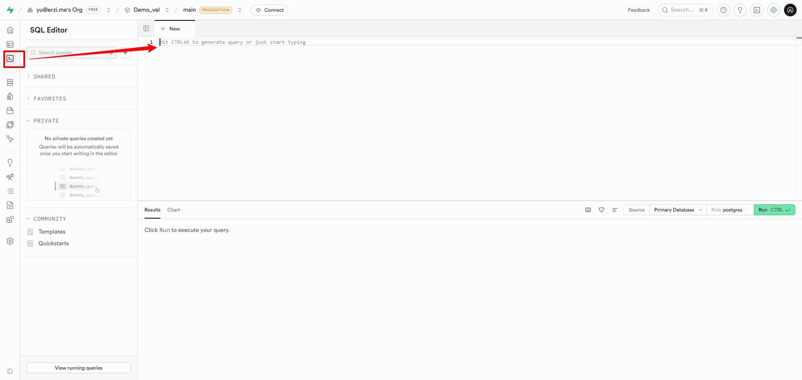
  <figcaption>第一步</figcaption>
</figure>

<figure class="full-bleed">
  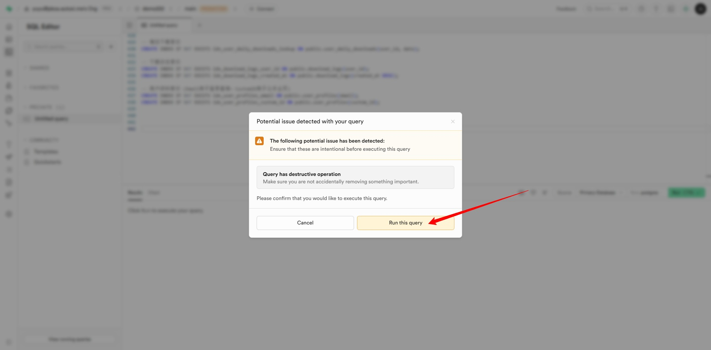
  <figcaption>第二步</figcaption>
</figure>

<figure class="full-bleed">
  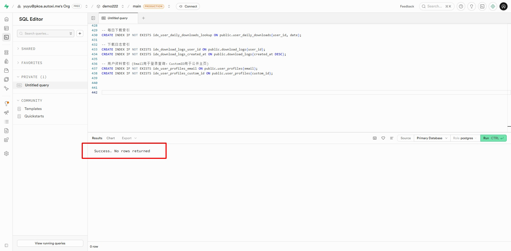
  <figcaption>第三步</figcaption>
</figure>

<figure class="full-bleed">
  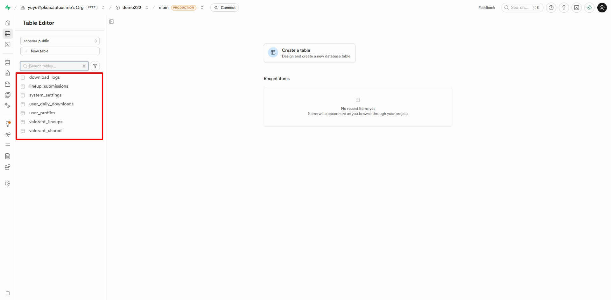
<figcaption>第四步</figcaption>
</figure>

## ✅ 验证结果

执行脚本后，在 `Table Editor` 中应看到以下 7 张表：

| 表名 | 说明 |
|------|------|
| `user_profiles` | 用户资料 |
| `valorant_lineups` | 个人点位 |
| `valorant_shared` | 共享点位 |
| `lineup_submissions` | 投稿审核 |
| `user_daily_downloads` | 下载限制 |
| `system_settings` | 系统设置 |
| `download_logs` | 下载日志 |

## 👑 注册超级管理员

> [!IMPORTANT]
> 执行提权脚本前，请先在 ValPoint 网站完成账号注册。只有已注册的用户才能被设置为超级管理员。

在 SQL Editor 中执行以下脚本，将指定邮箱的用户提权为超级管理员：

::: details 点击查看提权脚本

```sql
-- 请将 'your_email@example.com' 替换为你刚刚注册的邮箱
UPDATE public.user_profiles 
SET role = 'super_admin' 
WHERE id = (
    SELECT id 
    FROM auth.users 
    WHERE email = 'your_email@example.com'
);
```

:::

<figure class="full-bleed">
  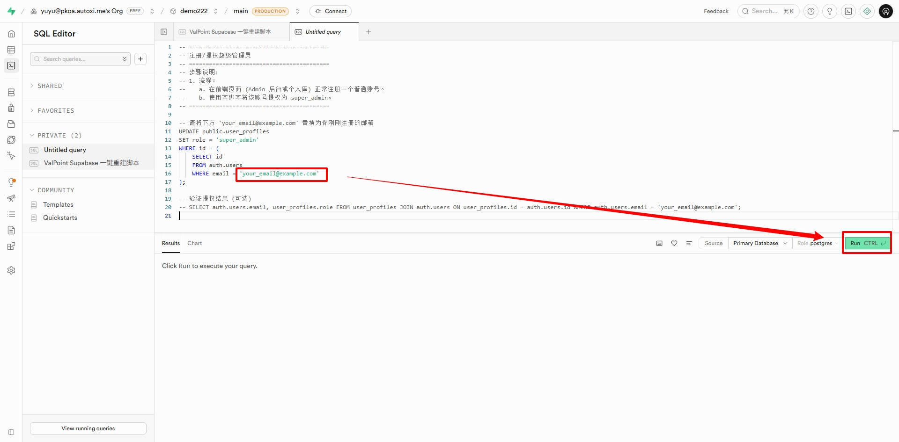
  <figcaption>第五步：执行提权脚本</figcaption>
</figure>

::: details 验证提权结果（可选）

```sql
SELECT auth.users.email, user_profiles.role 
FROM user_profiles 
JOIN auth.users ON user_profiles.id = auth.users.id 
WHERE auth.users.email = 'your_email@example.com';
```

:::

<figure class="full-bleed">
  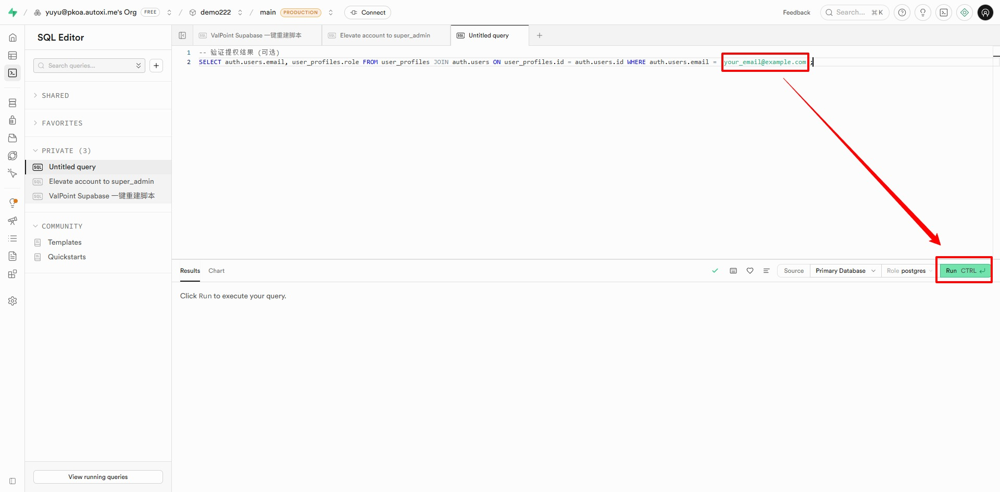
  <figcaption>第六步：验证提权结果</figcaption>
</figure>

## 🔧 Edge Functions

在 `Supabase Dashboard` → `Edge Functions` 中创建 `get-video-author` 函数：

::: details 点击查看 Edge Function 代码

```typescript
import { serve } from "https://deno.land/std@0.168.0/http/server.ts"

const corsHeaders = {
  'Access-Control-Allow-Origin': '*',
  'Access-Control-Allow-Headers': 'authorization, x-client-info, apikey, content-type',
}

// 抖音 HTML 清洗函数
function cleanHtml(text: string) {
  let decoded = text
    .replace(/\\u002F/g, "/")
    .replace(/\\u0026/g, "&")
    .replace(/\\"/g, '"')
    .replace(/&quot;/g, '"')
    .replace(/&amp;/g, '&')
    .replace(/\\\//g, '/');
  try { decoded = decodeURIComponent(decoded); } catch (e) {}
  return decoded;
}

// Bilibili 解析
async function handleBilibili(targetUrl: string) {
  const bvMatch = targetUrl.match(/(BV[a-zA-Z0-9]+)/)
  if (!bvMatch) throw new Error("未找到有效的 BV 号")
  
  const bvid = bvMatch[1]
  const apiUrl = `https://api.bilibili.com/x/web-interface/view?bvid=${bvid}`
  const headers = {
    "User-Agent": "Mozilla/5.0 (Windows NT 10.0; Win64; x64) AppleWebKit/537.36",
    "Referer": "https://www.bilibili.com/"
  }

  const response = await fetch(apiUrl, { headers })
  const json = await response.json()

  if (json.code === 0 && json.data) {
    const owner = json.data.owner
    return {
      username: owner.name,
      avatar: owner.face,
      user_home_url: `https://space.bilibili.com/${owner.mid}`,
      is_cover: false,
      source: "bilibili",
      cover_image: json.data.pic
    }
  } else {
    throw new Error(`B站 API 报错: ${json.message}`)
  }
}

// 抖音解析
async function handleDouyin(targetUrl: string) {
  const headers = {
    "User-Agent": "Mozilla/5.0 (iPad; CPU OS 13_3 like Mac OS X)",
    "Referer": "https://www.douyin.com/"
  }

  const response = await fetch(targetUrl, { headers })
  const html = cleanHtml(await response.text())

  let nickname = "", avatar = "", sec_uid = ""
  
  // 提取用户主页
  const linkMatch = html.match(/href=["']\/\/www\.douyin\.com\/user\/(MS4wLjABAAAA[A-Za-z0-9_\\-]+)["']/)
  if (linkMatch) sec_uid = linkMatch[1]
  
  // 提取头像
  const avatarMatch = html.match(/"url_list":\["(https:\/\/[^"]*?aweme-avatar[^"]*?)"/)
  if (avatarMatch) avatar = avatarMatch[1]
  
  // 提取用户名
  const titleMatch = html.match(/<title>(.*?)[\s-]*抖音/)
  if (titleMatch) nickname = titleMatch[1].trim()

  return {
    username: nickname || "未提取到",
    avatar: avatar || "",
    user_home_url: sec_uid ? `https://www.douyin.com/user/${sec_uid}` : "",
    is_cover: false,
    source: "douyin"
  }
}

// 主入口
serve(async (req) => {
  if (req.method === 'OPTIONS') return new Response('ok', { headers: corsHeaders })

  try {
    const body = await req.json()
    const urlText = body.url || ""
    if (!urlText) throw new Error("缺少 URL 参数")

    const douyinRegex = /(https?:\/\/(?:v|www|m)\.douyin\.com\/[^\s"']+)/
    const biliRegex = /(https?:\/\/(?:www|m)\.bilibili\.com\/video\/[^\s"']+)|(https?:\/\/b23\.tv\/[^\s"']+)/

    let result;
    const matchDouyin = urlText.match(douyinRegex)
    const matchBili = urlText.match(biliRegex)

    if (matchDouyin) {
      result = await handleDouyin(matchDouyin[0])
    } else if (matchBili) {
      let finalUrl = matchBili[0]
      if (finalUrl.includes("b23.tv")) {
        const r = await fetch(finalUrl, { redirect: 'follow' })
        finalUrl = r.url
      }
      result = await handleBilibili(finalUrl)
    } else {
      throw new Error("无效链接：未识别到 抖音 或 B站 链接")
    }

    return new Response(
      JSON.stringify({ status: "success", data: result }),
      { headers: { ...corsHeaders, "Content-Type": "application/json" } }
    )

  } catch (error) {
    return new Response(
      JSON.stringify({ error: error.message }),
      { headers: { ...corsHeaders, "Content-Type": "application/json" }, status: 400 }
    )
  }
})
```

:::

<figure class="full-bleed">
  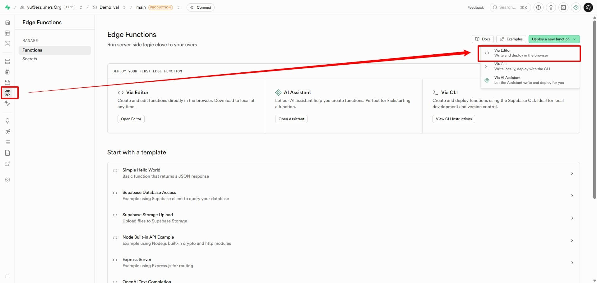
  <figcaption>第一步</figcaption>
</figure>

<figure class="full-bleed">
  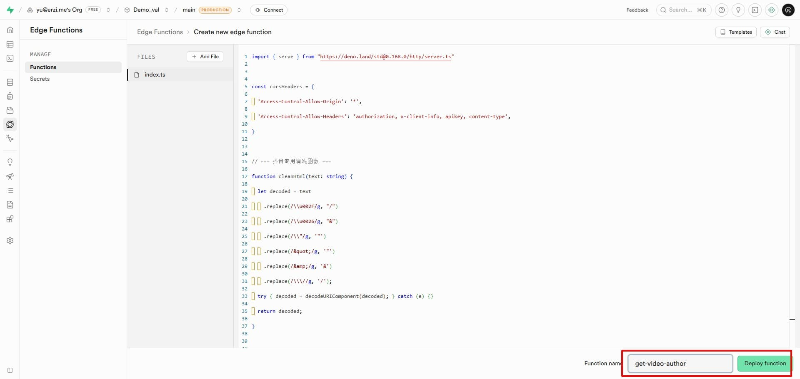
  <figcaption>第二步</figcaption>
</figure>

<figure class="full-bleed">
  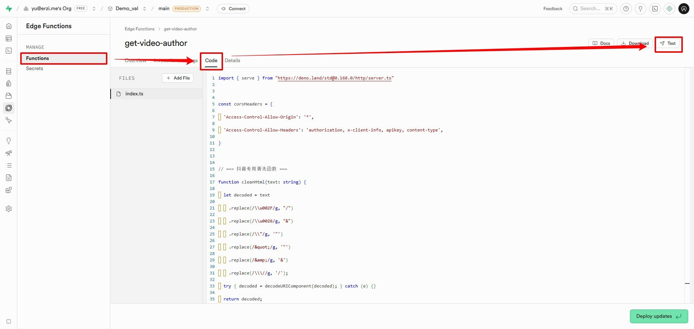
  <figcaption>第三步</figcaption>
</figure>

``` json
{ "url": "【《花海》魔法钢琴版】 【精准空降到 01:32】 https://www.bilibili.com/video/BV19QiFB5EMC/?share_source=copy_web&vd_source=fd59995bf2f70580369462145819da94&t=92" }

```

<figure class="full-bleed">
  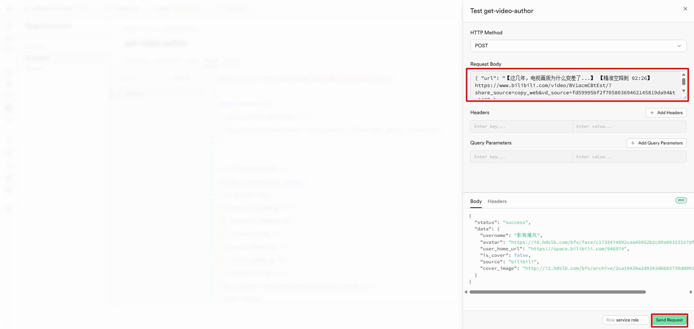
  <figcaption>第四步:验证是否有效</figcaption>
</figure>

<figure class="full-bleed">
  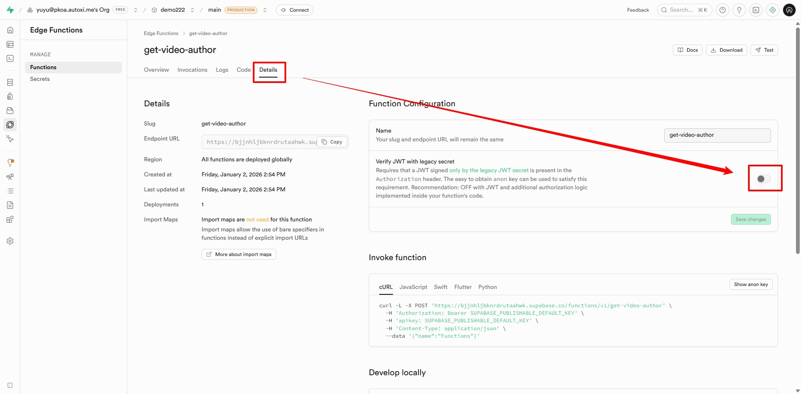
  <figcaption>第五步</figcaption>
</figure>


