# 部署指南

**ValPoint** 可以部署到多个平台，推荐使用 `Vercel` 或 `Cloudflare Pages` 。

| 平台 | 是否真·一键 | README 按钮 | 自动 Fork | 环境变量引导
| :--- | :--- | :--- | :--- | :--- |
| Docker | ⭐⭐⭐⭐⭐ | N/A | N/A | ✅ 环境变量
| Vercel | ⭐⭐⭐⭐⭐ | ✅ 官方 | ✅ | ✅ 强制填写
| Cloudflare Pages | ⭐⭐⭐ | ⚠️ 半官方 | ❌ | ⚠️ 手动
| 阿里云 ESA | ⭐⭐⭐⭐ | ❌ 手动 | ❌ | ⚠️ 手动

::: info 一句话结论

👉 私有部署首选：**Docker**

👉 对外开源首选：Vercel

👉 国内/边缘/CDN：Cloudflare Pages

👉 国内加速首选：阿里云 ESA

:::

## 🐳 Docker 部署（推荐私有部署）

### 优势
- ✅ 完全自主可控
- ✅ 支持私有服务器
- ✅ 一键启动，无需 Node.js 环境
- ✅ 内置 Nginx 生产优化配置
- ✅ 环境变量灵活配置

### 方式一：使用 Docker Compose（推荐）

<figure class="full-bleed">
  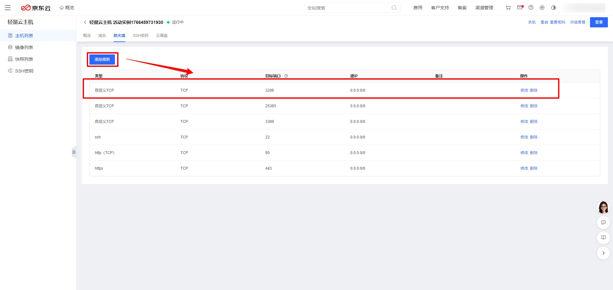
  <figcaption>第一步：云服务器的话要放行端口</figcaption>
</figure>

<figure class="full-bleed">
  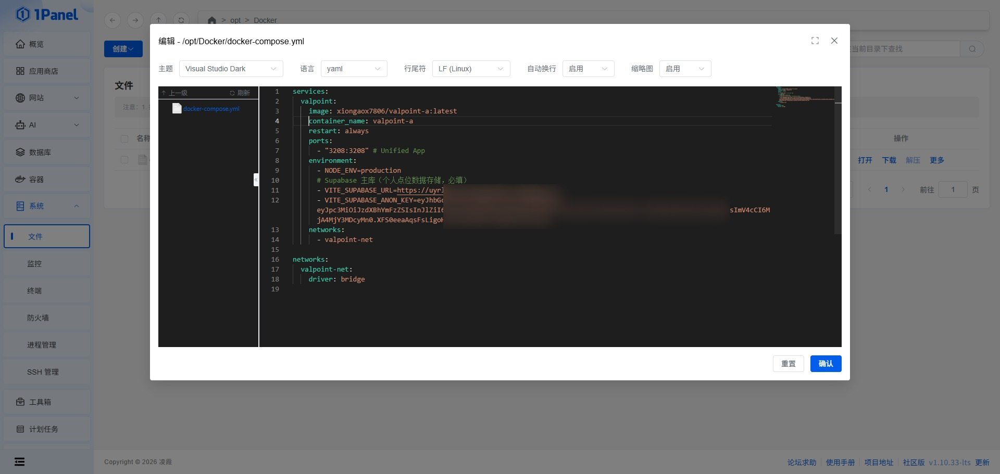
  <figcaption>第二步：docker-compose.yml</figcaption>
</figure>

#### 1. 创建 docker-compose.yml

::: details 点击查看完整配置

```yaml
services:
  valpoint:
    image: xiongaox7806/valpoint-a:latest
	container_name: valpoint-a
    restart: always
    ports:
      - "3208:3208"
    environment:
      - NODE_ENV=production
      # Supabase 配置（必填）
      - VITE_SUPABASE_URL=${VITE_SUPABASE_URL}
      - VITE_SUPABASE_ANON_KEY=${VITE_SUPABASE_ANON_KEY}
    networks:
      - valpoint-net

networks:
  valpoint-net:
    driver: bridge
```

:::

> [!TIP]
> 将上述配置中的 `${VAR}` 替换为你的实际值。

#### 2. 启动服务

```bash
# 启动容器
docker compose up -d

# 查看运行状态
docker compose ps

# 查看日志
docker compose logs -f

# 停止服务
docker compose down
```

#### 4. 访问应用

| 入口 | 地址 |
|------|------|
| 共享库（首页）| `http://localhost:8080` |
| 个人库 | `http://localhost:8080/user.html` |
| 管理后台 | `http://localhost:8080/admin.html` |

### 方式二：使用 Docker 命令

```bash
# 拉取官方镜像
docker pull xiongaox7806/valpoint-a:latest

# 运行容器
docker run -d \
  --name valpoint \
  -p 8080:3208 \
  -e VITE_SUPABASE_URL=https://[PROJECT_ID].supabase.co \
  -e VITE_SUPABASE_ANON_KEY=[YOUR_ANON_KEY] \
  xiongaox7806/valpoint-a:latest
```

### 方式三：自行构建镜像

```bash
# 克隆项目
git clone https://github.com/xiongaox/valpoint.git
cd valpoint

# 构建镜像
docker build -t valpoint:local .

# 运行
docker compose up -d
```

::: warning MPA 架构说明
项目采用多页面应用（MPA）架构，包含以下入口：
- `index.html` - 共享库（首页）
- `user.html` - 个人库
- `admin.html` - 管理后台
- `wiki.html` - 使用文档
- `404.html` - 404 页面

Nginx 配置已自动处理路由重写。
:::

## 🚀 Vercel 部署（推荐）

### 优势
- ✅ 自动构建和部署
- ✅ 全球 CDN 加速
- ✅ 免费 SSL 证书
- ✅ 自动预览部署
- ✅ 环境变量管理

### 部署步骤

> [!IMPORTANT]
> 先将项目 Fork 到你的 GitHub 账号，然后连接 GitHub 部署。

#### 1. 一键部署

点击下面按钮一键部署

[](
https://vercel.com/new/clone?repository-url=https://github.com/xiongaox/ValPoint&project-name=valpoint&repository-name=valpoint&env=VITE_SUPABASE_ANON_KEY,VITE_SUPABASE_URL
)

#### 2. 手动部署（可选）

1. 访问 [vercel.com](https://vercel.com) → `New Project`
2. 选择仓库 → `Import`
3. 添加环境变量（`VITE_SUPABASE_URL`、`VITE_SUPABASE_ANON_KEY`）
4. 点击 `Deploy`

#### 3. 配置自定义域名（可选）

1. 在 `Vercel` 项目设置中点击 `Domains`
2. 添加你的域名
3. 按照提示配置 `DNS` 记录

### 自动部署

配置完成后，每次推送到 `GitHub` 都会自动触发部署：
- `main` 分支 → 生产环境
- 其他分支 → 预览环境

### 具体步骤

<figure class="full-bleed">
  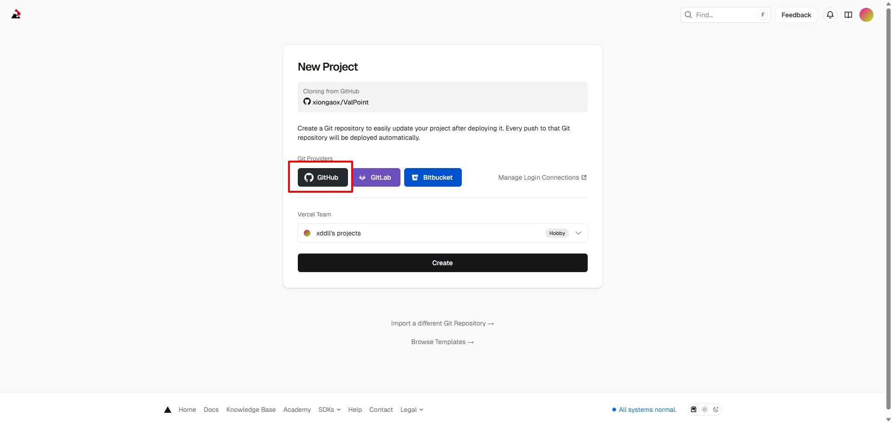
  <figcaption>第一步：绑定github</figcaption>
</figure>

<figure class="full-bleed">
  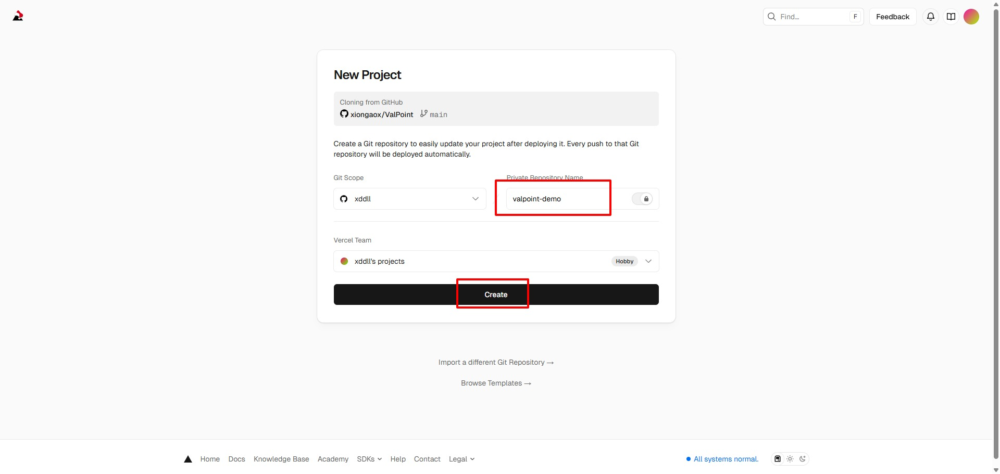
  <figcaption>第二步：设置项目名字</figcaption>
</figure>

<figure class="full-bleed">
  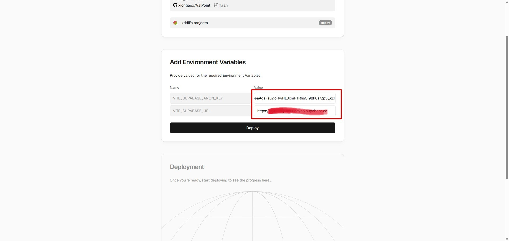
  <figcaption>第三步：配置环境变量</figcaption>
</figure>

<figure class="full-bleed">
  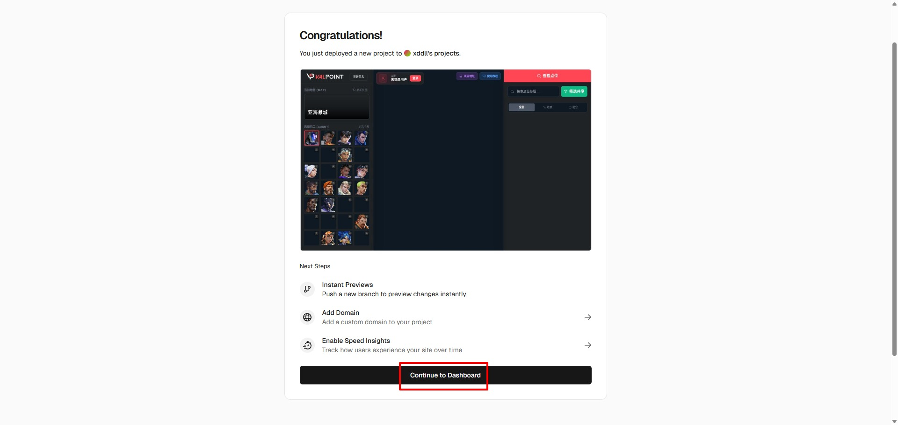
  <figcaption>第四步：稍等片刻</figcaption>
</figure>

<figure class="full-bleed">
  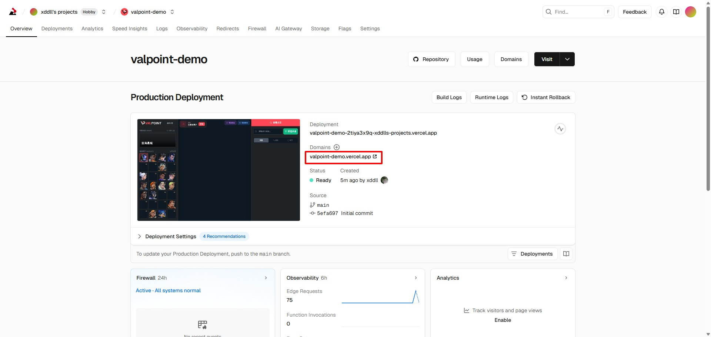
  <figcaption>第五步：访问域名</figcaption>
</figure>

<figure class="full-bleed">
  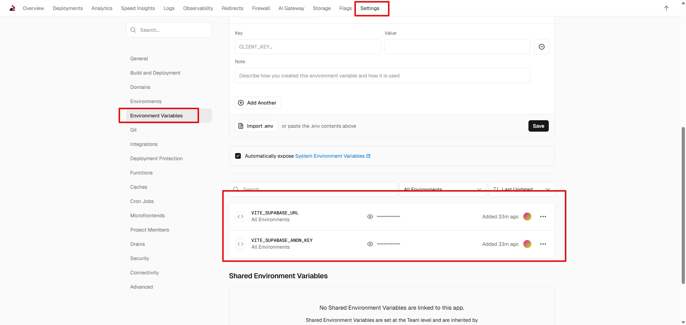
  <figcaption>第六步：如果启动黑屏，可以到这里修改环境变量</figcaption>
</figure>

<figure class="full-bleed">
  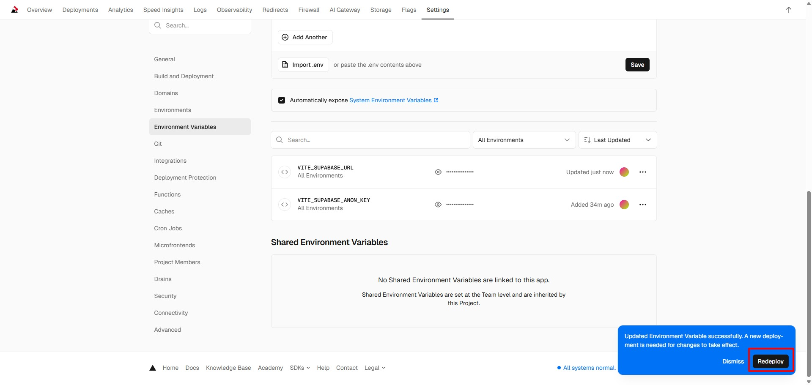
  <figcaption>第七步：重新部署</figcaption>
</figure>

<figure class="full-bleed">
  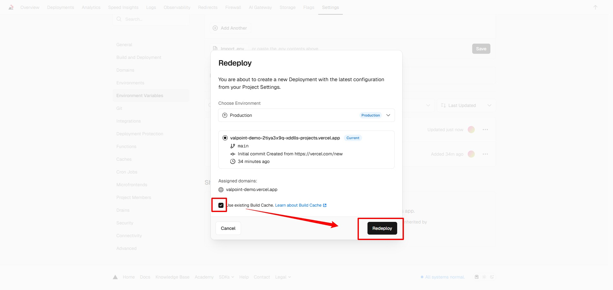
  <figcaption>第八步：</figcaption>
</figure>

## 🚀 Cloudflare Pages 部署

### 优势
- ✅ 全球 `CDN` 网络
- ✅ 无限带宽
- ✅ 免费 `SSL` 证书
- ✅ 快速构建

### 部署步骤

> [!IMPORTANT]
> 先将项目 Fork 到你的 GitHub 账号，然后连接 GitHub 部署。

#### 1. 一键部署

点击下面按钮一键部署

[](
https://dash.cloudflare.com/?to=/:account/pages/new
)

#### 2. 手动部署（可选）

1. 访问 [Cloudflare Pages](https://pages.cloudflare.com)
2. 点击 `Create a project` → 连接 GitHub
3. 选择 `ValPoint` 仓库
4. 构建配置：`npm run build`，输出目录 `dist`
5. 添加环境变量 → `Save and Deploy`

### 具体步骤

<figure class="full-bleed">
  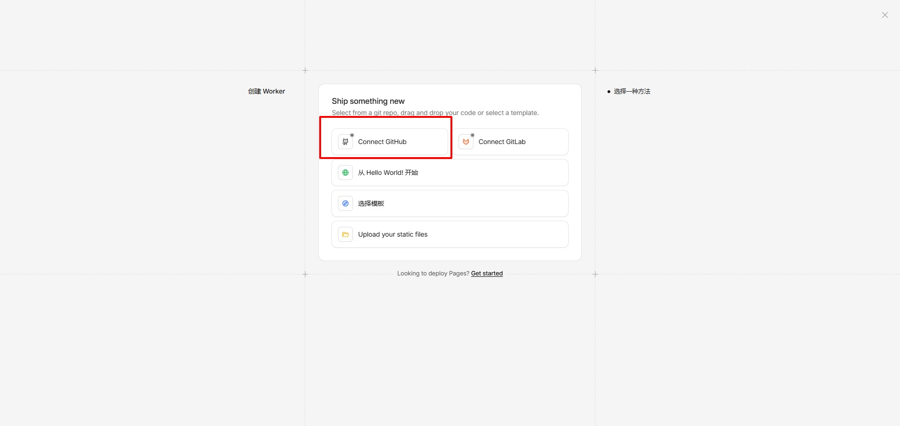
  <figcaption>第一步：绑定github</figcaption>
</figure>

<figure class="full-bleed">
  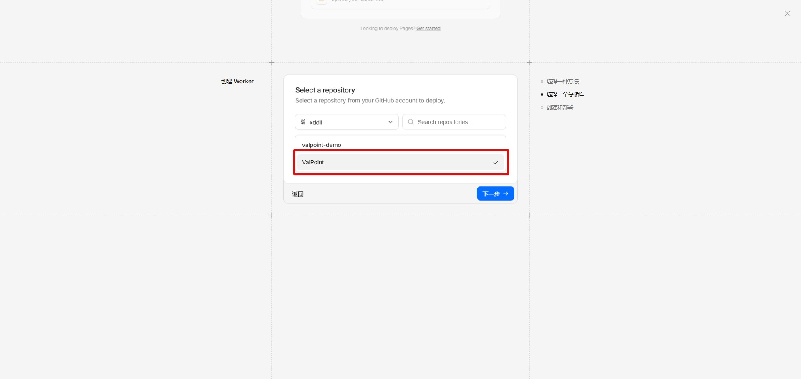
  <figcaption>第二步：设置项目名字</figcaption>
</figure>

<figure class="full-bleed">
  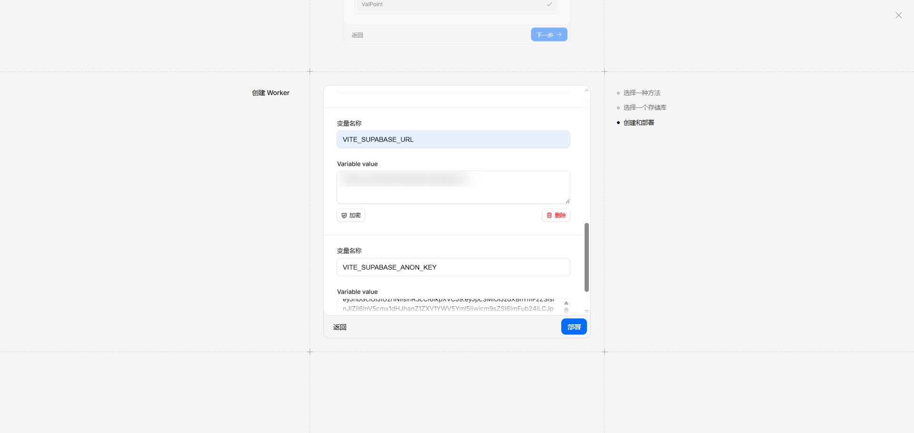
  <figcaption>第三步：配置环境变量</figcaption>
</figure>

<figure class="full-bleed">
  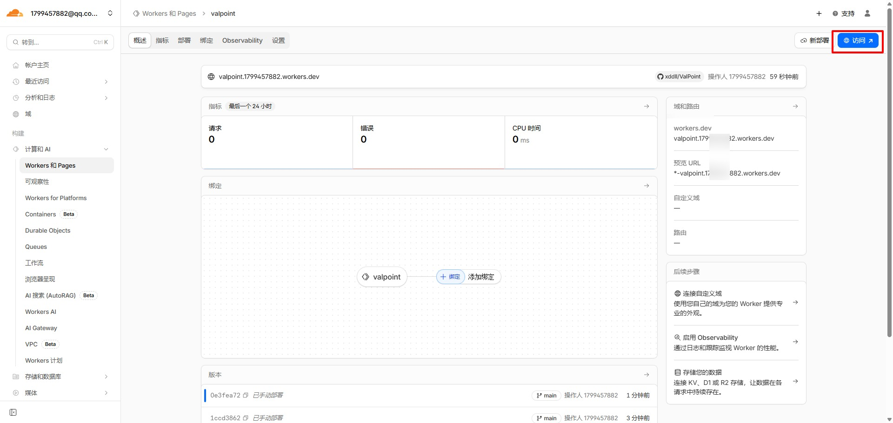
  <figcaption>第四步：访问域名</figcaption>
</figure>

<figure class="full-bleed">
  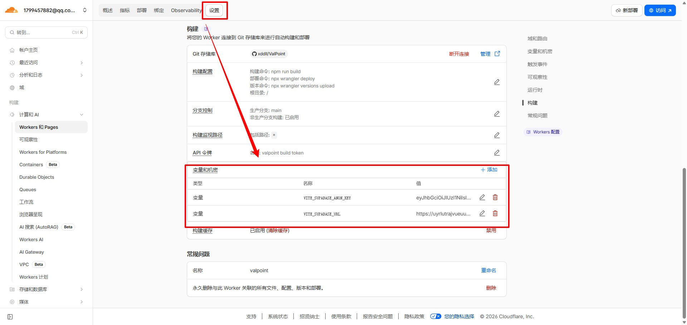
  <figcaption>第五步：如果启动黑屏，可以到这里修改环境变量</figcaption>
</figure>

<figure class="full-bleed">
  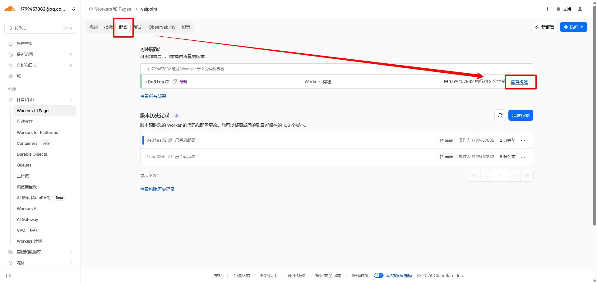
  <figcaption>第六步</figcaption>
</figure>

<figure class="full-bleed">
  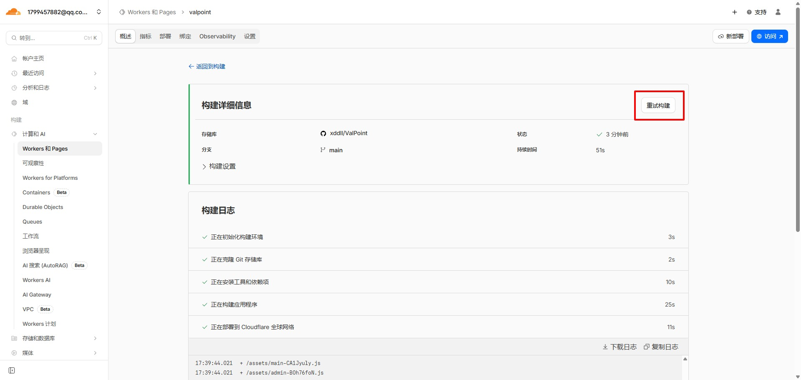
  <figcaption>第七步：重新构建</figcaption>
</figure>

<figure class="full-bleed">
  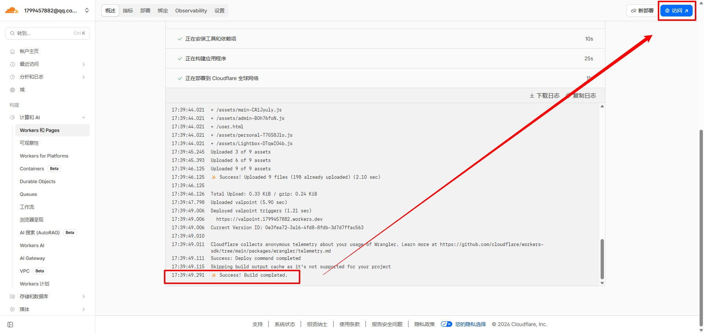
  <figcaption>第八步：部署成功</figcaption>
</figure>

## 🚀 阿里云 ESA 部署

### 优势
- ✅ 国内访问速度极快
- ✅ 全球边缘节点加速
- ✅ 自动 HTTPS
- ✅ 支持自定义域名

### 部署步骤

#### 1. 登录阿里云控制台

访问 [阿里云 ESA 控制台](https://esa.console.aliyun.com/)，开通边缘安全加速服务。

#### 2. 进入函数和 Pages

在控制台左侧菜单找到 `边缘函数和Pages`。

#### 3. 创建项目

点击 `创建` 按钮。

#### 4. 导入 GitHub 仓库

1. 选择 `导入 Git 仓库`
2. 授权 GitHub 账号
3. 选择 `ValPoint` 仓库

#### 5. 配置构建命令

::: warning 重要
必须将构建命令设置为 `npm run build:all`，否则 Wiki 文档无法正常访问。
:::

| 配置项 | 值 |
|--------|-----|
| 构建命令 | `npm run build:all` |
| 输出目录 | `dist` |

#### 6. 配置环境变量

::: tip 为什么需要拆分 Key？
阿里云 ESA 的环境变量有 **200 字符限制**，而 Supabase 的 `ANON_KEY` 通常超过 270 个字符。
因此需要将 Key 拆分成两部分，代码会自动拼接。
:::

在高级配置中添加以下环境变量：

```ini
# Supabase 地址（必填）
VITE_SUPABASE_URL=https://xxxxx.supabase.co

# 方式一：如果 Key 长度小于 200 字符，直接填写
VITE_SUPABASE_ANON_KEY=你的AnonKey

# 方式二：如果 Key 超过 200 字符，需要拆分成两部分
VITE_SUPABASE_ANON_KEY_1=eyJhbGciOiJIUzI1NiIsInR5cCI6IkpXVCJ9.eyJpc3MiOiJzdXBhYmFzZSIs...（前150字符）
VITE_SUPABASE_ANON_KEY_2=InJlZiI6InV5cmx1dHJhanZ1ZXV1YWV5Yml5Ii...（剩余字符）
```

**拆分方法：**
1. 找到你的 `ANON_KEY`（约 270+ 字符）
2. 在中间位置（建议在 `.` 后）截断
3. 前半部分填入 `VITE_SUPABASE_ANON_KEY_1`
4. 后半部分填入 `VITE_SUPABASE_ANON_KEY_2`

::: info 代码原理
```typescript
// 优先使用完整 Key，如果没有则自动拼接 KEY_1 + KEY_2
const anonKey = getEnv('VITE_SUPABASE_ANON_KEY')
  || (getEnv('VITE_SUPABASE_ANON_KEY_1') + getEnv('VITE_SUPABASE_ANON_KEY_2'));
```
:::

#### 7. 部署并访问

1. 点击 `保存并部署`
2. 等待构建完成


### 具体步骤

<figure class="full-bleed">
  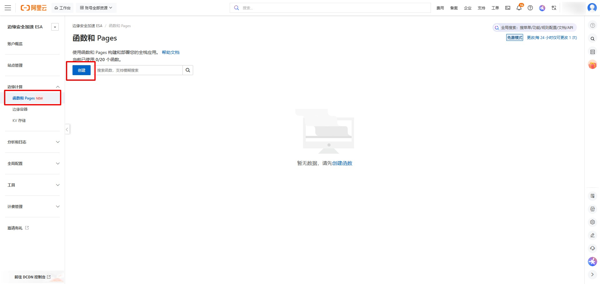
  <figcaption>第一步</figcaption>
</figure>

<figure class="full-bleed">
  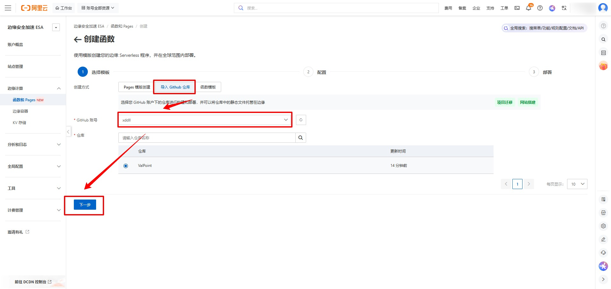
  <figcaption>第二步</figcaption>
</figure>

<figure class="full-bleed">
  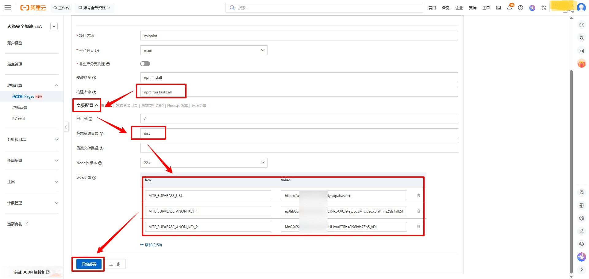
  <figcaption>第三步</figcaption>
</figure>

<figure class="full-bleed">
  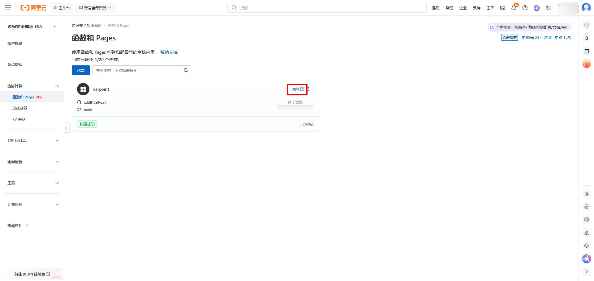
  <figcaption>第四步</figcaption>
</figure>

<figure class="full-bleed">
  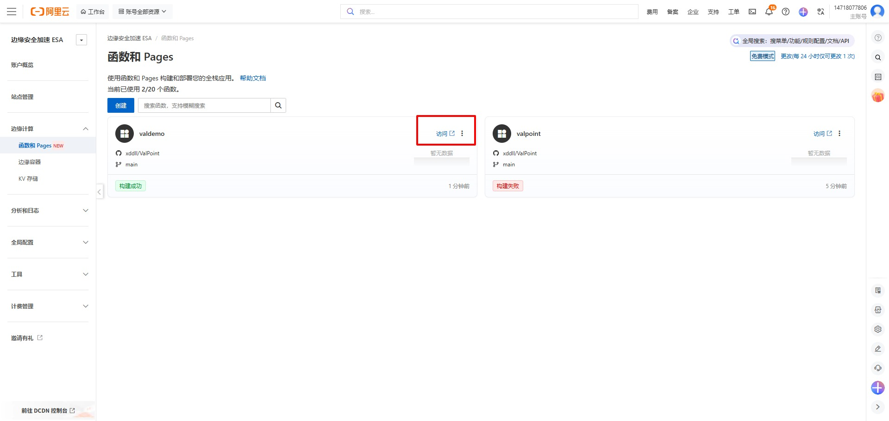
  <figcaption>第五步</figcaption>
</figure>

<figure class="full-bleed">
  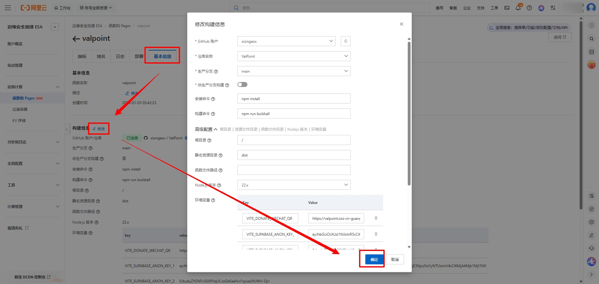
  <figcaption>第六步：如果启动黑屏，可以到这里修改环境变量</figcaption>
</figure>

<figure class="full-bleed">
  
  <figcaption>第七步：重新构建</figcaption>
</figure>

## 🚀 自托管部署

### 使用 Nginx

#### 1. 构建项目

```bash
npm run build
```

#### 2. 配置 Nginx

```nginx
server {
    listen 80;
    server_name valpoint.example.com;
    
    root /var/www/valpoint/dist;
    index index.html;
    
    # SPA 路由支持
    location / {
        try_files $uri $uri/ /index.html;
    }
    
    # 静态资源缓存
    location ~* \.(js|css|png|jpg|jpeg|gif|ico|svg)$ {
        expires 1y;
        add_header Cache-Control "public, immutable";
    }
    
    # Gzip 压缩
    gzip on;
    gzip_types text/plain text/css application/json application/javascript text/xml application/xml application/xml+rss text/javascript;
}
```

#### 3. 部署文件

```bash
# 上传构建产物
scp -r dist/* user@server:/var/www/valpoint/dist/

# 重启 Nginx
ssh user@server "sudo systemctl restart nginx"
```

## ❓ 常见问题

### Q: 部署后页面空白？

检查：
1. 环境变量是否配置正确
2. 构建是否成功
3. 浏览器控制台是否有错误

### Q: 路由 404 错误？

需要配置 `SPA` 路由重写：
- Vercel：自动配置
- Cloudflare Pages：自动配置
- Nginx：添加 `try_files` 配置

### Q: 环境变量不生效？

确保：
1. 变量名以 `VITE_` 开头
2. 重新构建项目
3. 清除浏览器缓存

### Q: 构建失败？

检查：
1. `Node.js` 版本（需要 >= 18）
2. 依赖是否安装完整
3. 构建日志中的错误信息

### Q: 如何回滚部署？

- Vercel：在 `Deployments` 页面选择之前的部署，点击 `Promote to Production`
- Cloudflare Pages：在 `Deployments` 页面选择之前的部署，点击 `Rollback`
- 自托管：恢复之前的构建产物
